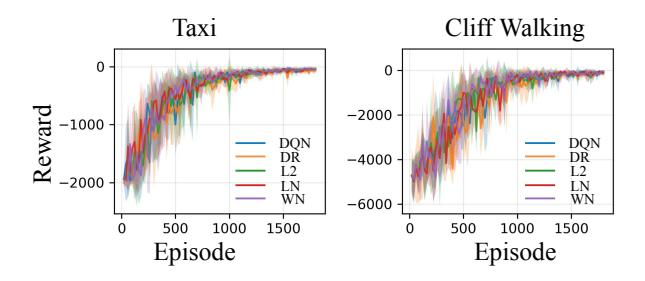
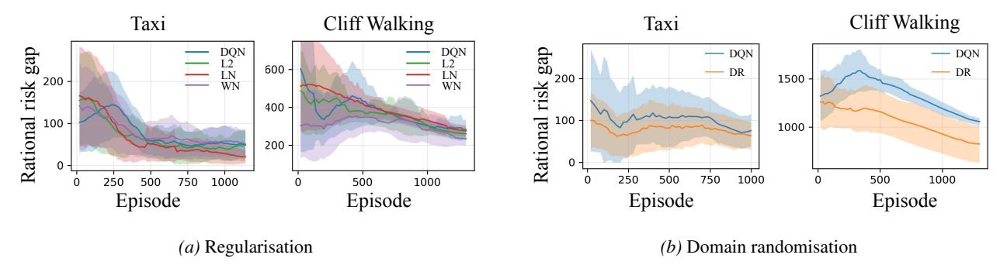
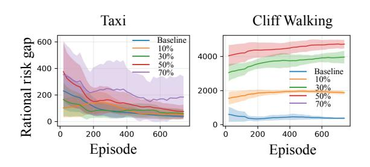
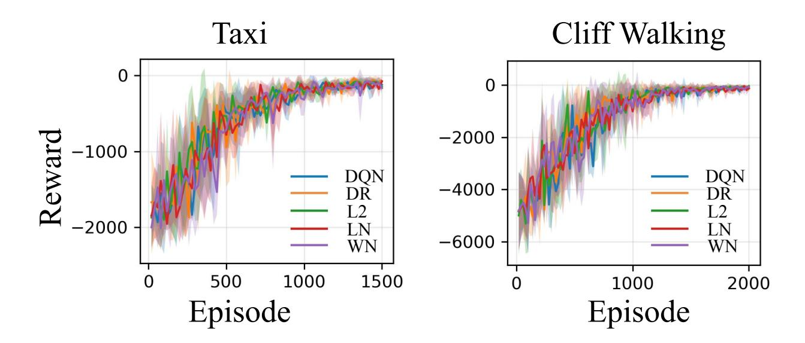
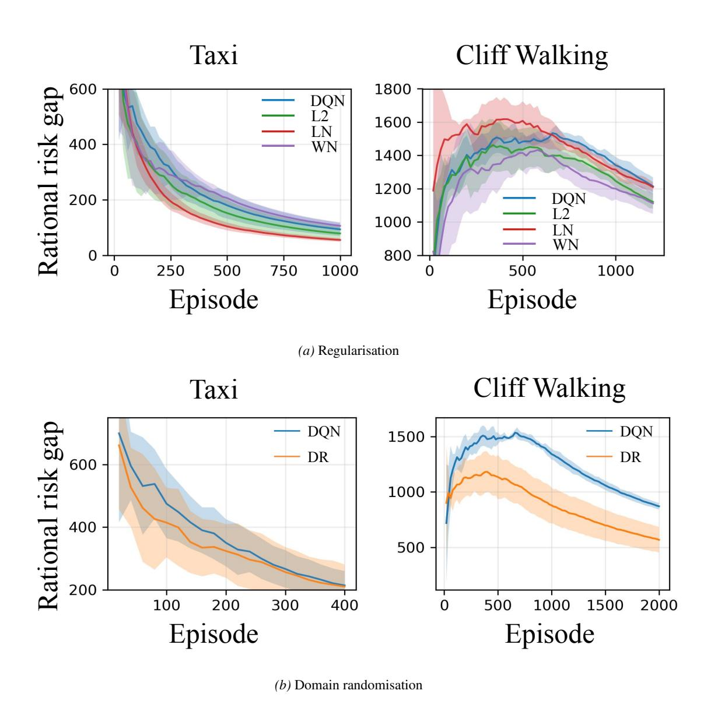
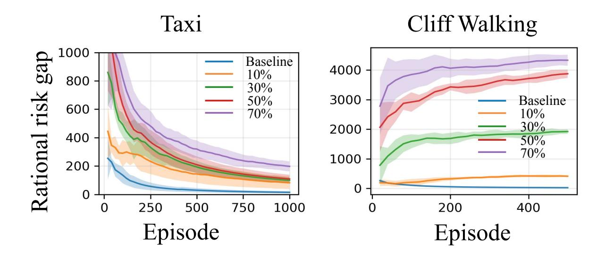

{0}------------------------------------------------

# Rationality Measurement and Theory for Reinforcement Learning Agents

### Kejiang Qian 1 Amos Storkey 1 Fengxiang He 1

## Abstract

This paper proposes a suite of rationality measures and associated theory for reinforcement learning agents, a property increasingly critical yet rarely explored. We define an action in deployment to be perfectly rational if it maximises the hidden true value function in the steepest direction. The expected value discrepancy of a policy's actions against their rational counterparts, culminating over the trajectory in deployment, is defined to be expected rational risk; an empirical average version in training is also defined. Their difference, termed as rational risk gap, is decomposed into (1) an extrinsic component caused by environment shifts between training and deployment, and (2) an intrinsic one due to the algorithm's generalisability in a dynamic environment. They are upper bounded by, respectively, (1) the 1- Wasserstein distance between transition kernels and initial state distributions in training and deployment, and (2) the empirical Rademacher complexity of the value function class. Our theory suggests hypotheses on the benefits from regularisers (including layer normalisation, ℓ2 regularisation, and weight normalisation) and domain randomisation, as well as the harm from environment shifts. Experiments are in full agreement with these hypotheses. The code is available at [https://github.com/EVIEHub/Rationality.](https://github.com/EVIEHub/Rationality)

### 1. Introduction

Reinforcement learning is rapidly advancing toward humanlevel capabilities in many domains, such as robotics [\(Nguyen & La,](#page-10-0) [2019\)](#page-10-0), autonomous vehicles [\(Feng et al.,](#page-9-0) [2023\)](#page-9-0), finance [\(Liu et al.,](#page-10-1) [2022b\)](#page-10-1), and reasoning in large language models (LLMs) [\(Shao et al.,](#page-10-2) [2024\)](#page-10-2). They are increasingly embedded in real-world, high-stakes systems that

*Proceedings of the* 43 rd *International Conference on Machine Learning*, Seoul, South Korea. PMLR 306, 2026. Copyright 2026 by the author(s).

directly impact human lives and social fabric. For example, we can expect to share public roads with autonomous vehicles in the near future; in financial markets, reinforcement learning already accounts for a substantial proportion of trading activities. The increasing penetration of reinforcement learning agents in society calls for an understanding of their behaviours through the economic lens. Rationality is fundamental to this end: it characterises agent behaviour in decision making that maximise their utilities given accessible information, making it possible to economically study agent behaviours [\(von Neumann & Morgenstern,](#page-11-0) [1944;](#page-11-0) [Dayan &](#page-9-1) [Daw,](#page-9-1) [2008;](#page-9-1) [Sen,](#page-10-3) [1994\)](#page-10-3).

We mathematically define an action to be *perfectly rational* if it maximises the actual value function (though it might be unknown) in the steepest direction. An agent can not be perfectly rational, i.e., of bounded rationality [\(Simon,](#page-10-4) [1990;](#page-10-4) [Conlisk,](#page-9-2) [1996\)](#page-9-2), leading to loss in action-value function, defined as *rational value loss*. This paper is particularly interested in the rationality in deployment (or "inference"). Cumulating the expected rational value loss over the trajectory in inference, we define an *expected rational value risk*. This measure is not directly accessible; we then define an estimator, *empirical rational value risk*, to be the empirical average version in training. Their difference, termed *rational risk gap*, measures the rationality of agents in deployment, given their observable behaviour in training, which is central in the theoretical development in this paper. To note, this suite of measures takes a "local and immediate" perspective: an action is defined to be rational if this *individual* move is optimal, given all information *available at that time*. This setting coincides with a large volume of literature in economics, such as [Sen](#page-10-5) [\(2002\)](#page-10-5); [Gershman et al.](#page-9-3) [\(2015\)](#page-9-3).

The rational risk gap is decomposed into two components: (1) an *extrinsic rational gap*, caused by the environment shifts between training and deployment, and (2) an *intrinsic rational gap*, determined by the algorithm itself. This decomposition provides a lens for understanding the sources of sub-rationality. We prove that the two components are upper bounded as follows. The extrinsic rational gap is bounded by LsH ·W1(p † 0 , p0)+H2Ls(Lp + 1)·W1(p † , p), relying on the 1-Wasserstein distance W1(p † 0 , p0) between initial state distributions p † 0 in inference and p0 in training, 1-Wasserstein distance W1(p † , p) between transition kernels p † in inference and p in training, Lipschitz constant Ls of

1University of Edinburgh. Correspondence to: Fengxiang He <fhe@ed.ac.uk>.

{1}------------------------------------------------

the mapping from state to value function, Lipschitz constant  $L_p$  of the mapping from transition kernel to its induced state distributions, and horizon H of an episode. This term may help understand the sim-to-real transfer challenge (Da et al., 2025). The intrinsic rational gap has an upper bound  $L_\Pi H \sqrt{2\log |\mathcal{A}|} + 2\sum_{h=1}^H \hat{\mathfrak{R}}_h(\mathcal{Q}_\Pi) + 3H^2\sqrt{\frac{\log(4H/\delta)}{2T}}$ , for any  $\delta \in (0,1)$ , with probability at least  $1-\delta$ , relying on the empirical Rademacher complexity of value-function class  $\mathcal{Q}_\Pi$ , Lipschitz constant  $L_\Pi$  of the mapping from policy  $\pi$  to its induced state distribution, the action space cardinality  $|\mathcal{A}|$ , and the training episode number T.

Our theory suggests empirically testable hypotheses: (1) regularisers, including layer normalisation (Ba et al., 2016),  $\ell_2$ -regularisation, and weight normalisation (Salimans & Kingma, 2016) control the hypothesis complexity of value function class, contributing positively to rationality; (2) domain randomisation (Tobin et al., 2017) improves robustness across environments, also making benefits to rationality, and (3) environment shifts between training and deployments, are harmful to rationality. We conduct experiments to verify these hypotheses, employing Deep Q-Network (DQN) (Mnih et al., 2013) on the Taxi-v3 (Dietterich, 2000) and Cliff Walking environments (Sutton & Barto, 2018). The empirical results are in full agreement with the hypotheses.

To our best knowledge, this work is the first to develop a mathematical framework for measuring the rationality of reinforcement learning agents. Our theory sheds light on understanding and improving the rationality of reinforcement learning, which is increasingly critical in this era, as we are inevitably and irreversibly marching into a human-AI co-existing society.

#### 1.1. Related works

Rationality of machine learning Efforts to study the rationality of machine learning are seen in the literature. Valiant (1995) proposes a philosophical definition: rationality is the ability to abstract and utilise available information to understand, predict, and control the environment, with a probably approximately correct (PAC) style criterion. Abel (2019) provides a formal characterisation for bounded rationality of reinforcement learning, showing that rational decisions depend on how agents represent environments, balancing simplicity and predictive accuracy. Analysing behavioural data from human participants, Evans et al. (2025) introduces the Wasserstein distance between the learned policy and prior as a constraint to model bounded rationality in reinforcement learning. Sunehag & Hutter (2015) establish decision-theoretic axioms of rational reinforcement learning agents, but these exclude a large class of commonly used algorithms, such as those relying on  $\epsilon$ -greedy exploration, which are evaluated as irrational and out of their scope. Despite these conceptual formalisations and empirical works, a theoretical framework remains absent, summarised by Macmillan-Scott & Musolesi (2025).

Value alignment in reinforcement learning The reinforcement learning literature has seen extensive efforts on aligning agents' value with some optimal value, either explicitly or implicitly. For example, the "classic" reinforcement learning is usually around optimising regret, defined as the cumulative suboptimality in terms of getting rewards (Jin et al., 2020; Azar et al., 2017). The same applies in using reinforcement learning for LLM value alignment (Shao et al., 2024). However, even if an agent (or LLM) has perfectly learned the optimal value, it can still behave suboptimally in deployment (or reasoning), because the agent fails to take the actions that optimise the aligned value.

Generalisation in reinforcement learning Generalisation in reinforcement learning is more subtle than in supervised learning because here data is generated by correlated trajectories, and learned policies influence observation. Existing papers establish within-environment guarantees in finite MDPs via PAC and regret analyses (Strehl et al., 2006; Jaksch et al., 2010; Azar et al., 2017); and approximate dynamic programming characterises how estimation and approximation errors propagate through Bellman backups (Munos & Szepesvári, 2008). More recent work replaces dependence on state space with structural complexity measures for rich observations, e.g., Eluder Dimension and Bellmantype ranks (Russo & Van Roy, 2013; Jiang et al., 2017; Sun et al., 2019; Jin et al., 2021). For deep reinforcement learning, Liu et al. (2022a) casts temporal-difference error as a generalisation problem under neural function approximation; and Wang et al. (2019) analyses the generalisation gap in the reparameterisable settings.

#### 2. Preliminaries

**Episodic Markov decision process (EMDP)** Suppose an agent, at state  $s \in \mathcal{S}$ , takes an action a from a finite space  $\mathcal{A}$  that transits her to state s' sampled from transition kernel  $p(\cdot \mid s, a) \in \Delta(\mathcal{S})$ , and then receives an immediate reward r. The action is sampled from policy  $\pi \in \Pi$ ,  $\pi : \mathcal{S} \to \Delta(\mathcal{A})$ , relying on state s. We assume the learning process is "episodic": agents, in every episode, start at initial states  $s_1$  drawn from distribution  $p_0(\cdot) \in \Delta(\mathcal{S})$ , run for H time steps (i.e., the horizon), and yield returns  $\sum_{h=1}^{H} r_h \ (r_h \in [0,1])$ . Intermediate policies  $\pi_t = \{\pi_h^t\}_{h=1}^{H}$  are generated during the training of T episodes in total. Given a policy  $\pi$  and a transition kernel p, a trajectory  $\mathbf{s}_{h:H}^t = (s_h^t, s_{h+1}^t, \cdots, s_H^t)$  is taken in episode t. This setting is termed EMDP  $\mathcal{M} = (\mathcal{S}, \mathcal{A}, H, \{r_h\}_{h=1}^{H}, \{p_h\}_{h=1}^{H}, p_0)$ .

A policy can be evaluated by action-value function  $Q_h^\pi(s,a) = \mathbb{E}_\pi \left[ \sum_{j=h}^H r_j \mid s_h = s, a_h = a \right]$  and value

{2}------------------------------------------------

function  $V_h^\pi(s) = \mathbb{E}_\pi \left[ \sum_{j=h}^H r_j \mid s_h = s \right]$ . A terminal condition  $V_{H+1}^\pi(s) = 0$  indicates that no reward is gained beyond the horizon H. Value functions are recursively defined, governed by the Bellman equations:  $V_h^\pi(s) = \mathbb{E}_{a \sim \pi(\cdot \mid s)}[Q_h^\pi(s,a)], \ Q_h^\pi(s,a) = r_h + \mathbb{E}_{s' \sim p_h(\cdot \mid s,a)}[V_{h+1}^\pi(s')].$ 

**Training-to-deployment shifts** Suppose the training environment has transition kernels  $p = \{p_h\}_{h=1}^H$  and an initial state distribution  $p_0$ . A policy  $\pi$  induces a state distribution  $\mathcal{D}_h^{\pi}$  at time step h, termed state distribution in training (Cobbe et al., 2020; Wang et al., 2020). Similarly, the deployment environment has different transition kernels  $p^{\dagger} = \{p_h^{\dagger}\}_{h=1}^H$  and initial distribution  $p_0^{\dagger}$ , under which a state distribution in deployment  $\mathcal{D}_h^{\pi,\dagger}$  is induced.

Following Liu et al. (2022a); Wang et al. (2019), this paper assumes the *episode independence*, defined as below,

**Assumption 1** (episode independence). For any  $t=1,\ldots,T$ , state  $s_h^t$  is sampled from a distribution  $\mathcal{D}_h^{\pi_t}$ , i.e.,  $s_h^t \sim \mathcal{D}_h^{\pi_t}$ . The variables  $\mathbf{s}_h^{1:T} = \{s_h^t\}_{t=1}^T$  are independent, but not necessarily identically distributed.

In this setting, the objective of a reinforcement learning algorithm is to find an optimal policy  $\pi^*$  that maximises the expected rewards over the trajectory in deployment:

$$\pi^* = \arg\max_{\pi \in \Pi} \mathbb{E}_{s_h \sim \mathcal{D}_h^{\pi,\dagger}} \left[ V_h^{\pi,\dagger}(s_h) \right].$$

This paper employs Wasserstein distance (Kantorovich, 1960; Villani, 2008) to measure environment shifts.

**Definition 1** (p-Wasserstein distance). Let  $S \subseteq \mathbb{R}^d$  be a metric space equipped with a distance function d.  $\mu$  and  $\nu$  are two probability measures on S. For any  $p \geq 1$ , the p-Wasserstein distance between  $\mu$  and  $\nu$  is defined to be

$$W_p(\mu, \nu) \triangleq \left(\inf_{\gamma} \int_{S \times S} d(x, y)^p \, d\gamma(x, y)\right)^{1/p},$$

where the infimum is taken over all joint distributions  $\gamma$  on  $\mathcal{S} \times \mathcal{S}$  whose marginals coincide with  $\mu$  and  $\nu$ .

We employ the Total Variation (TV) distance to measure the distance between policies (Boucheron et al., 2013).

**Definition 2** (Total Variation (TV) distance). The TV distance between two distributions  $\mu$ ,  $\nu$  is defined as,

$$d_{\Pi}(\mu, \nu) \triangleq \frac{1}{2} \sum_{x \in \mathcal{X}} |\mu(x) - \nu(x)|.$$

The TV distance can be controlled by the Kullback-Leibler (KL) divergence (Pinsker, 1964).

**Definition 3** (Kullback-Leibler (KL) divergence). The KL divergence between two distributions  $\mu, \nu$  is defined as,

$$\mathrm{KL}(\mu \| \nu) \triangleq \sum_{x \in \mathcal{X}} \mu(x) \log \frac{\mu(x)}{\nu(x)}.$$

**Hypothesis complexity** Let the class of value functions be  $Q_{\Pi} \triangleq \{s \mapsto Q_h^*(s, a_h^{\pi}) : \pi \in \Pi, h \in [H]\}$ . For brevity, we use  $f(s) = Q_h^*(s, a_h^{\pi}) \triangleq Q_h^{\pi^*}(s, a_h^{\pi})$ . Rademacher complexity, and its empirical version (Bartlett & Mendelson, 2003; Liu et al., 2022a), are employed to measure the hypothesis complexity. We define the empirical version here, and present Rademacher complexity in Appendix C.

**Definition 4** (empirical Rademacher complexity). Let  $\mathcal{F} \subseteq \mathbb{R}^{\mathcal{S}}$  be a function class and  $\mathbf{s}^{1:n} = \{s^i\}_{i=1}^n$  be a sample set. Let  $\sigma^{1:n} = (\sigma^1, \dots, \sigma^n)$  be independent Rademacher random variables. The *empirical Rademacher complexity* of  $\mathcal{F}$  on the sample set  $\mathbf{s}^{1:n}$  is defined as

$$\hat{\mathfrak{R}}(\mathcal{F},\mathbf{s}^{1:n}) \triangleq \frac{1}{n} \mathbb{E}_{\pmb{\sigma}^{1:n}} \left[ \sup_{f \in \mathcal{F}} \sum_{i=1}^n \sigma^i f(s^i) \right].$$

### 3. Rationality measures

This section defines a suite of rationality measures for reinforcement learning. To note, we are particularly interested in the rationality in deployment. Intuitively, training processes usually employ gradient descent, or its variants, that optimise objectives in the steepest direction. In light of this, the rationality in training can be characterised by the discrepancy between the hidden actual value function and the objectives in optimisation.

#### 3.1. Rationality measures

We first define *perfectly rational actions*. For brevity, we also call them *rational actions* if no ambiguity is caused.

**Definition 5** (perfectly rational action). An action  $a_h^{\circ}$  is called *perfectly rational*, if its policy maximises the true value function of the state  $s_h$  at the time step h:

$$a_h^{\circ} \sim \pi^{\circ}(\cdot \mid s_h); \quad \pi^{\circ} \triangleq \arg \max_{\pi \in \Pi} \mathbb{E}_{a_h \sim \pi} \left[ Q_h^{*,\dagger}(s_h, a_h) \right].$$

*Remark* 1. As mentioned, the main goal is to study the rationality in deployment, which is not episodic.

A reinforcement learning agent may be of *bounded ratio-nality*; i.e., the agent does not always take rational actions. This incurs *rational value loss*, defined as below.

**Definition 6** (rational value loss). Let  $p^{\dagger}, p_0^{\dagger}$  denote the transition kernel and initial state distribution of the inference environment. The rational value loss of the taken action  $a_h^{\pi}$  drawn from policy  $\pi \in \Pi$  at step h is defined as:

$$\mathcal{L}(a_h^{\hat{\pi}}, s_h) \triangleq Q_h^{*,\dagger}(s_h, a_h^{\circ}) - Q_h^{*,\dagger}(s_h, a_h^{\pi}).$$

{3}------------------------------------------------

Remark 2. Compared with the advantage function  $A_h^{\pi}(s_h,a_h) = Q_h^{\pi}(s_h,a_h) - V_h^{\pi}(s_h)$  (Schulman et al., 2017), our definition adopts a behavioural perspective, comparing the action  $a_h^{\pi}$  with the perfectly rational action  $a_h^{\circ}$ . In contrast, the advantage function compares an action relative to the expectation over the action distribution.

From the definitions, we directly prove Lemma 1.

**Lemma 1.** If an action is perfectly rational, its rational value loss is zero.

We then define *expected rational value loss* in deployment.

**Definition 7** (expected rational value loss). Given the state distribution in deployment  $\mathcal{D}_h^{\pi,\dagger}$  induced by policy  $\pi \in \Pi$ , the expected rational value loss of the policy  $\pi$  at time step h is defined as:

$$\mathcal{R}_h(\pi) \triangleq \mathbb{E}_{s_h \sim \mathcal{D}_h^{\pi,\dagger}} \left[ Q_h^{*,\dagger}(s_h, a_h^{\circ}) - Q_h^{*,\dagger}(s_h, a_h^{\pi}) \right].$$

The inference environment is supposed to be unknown; thus, the expected rational value loss is usually inaccessible. We then define an empirical version in training.

**Definition 8** (empirical rational value loss). Suppose an agent is trained by T episodes, taking a sequence of states  $\{s_h^t\}_{t=1}^T$ . Let p,  $p_0$  denote the transition kernels and initial state distribution of the training environment. The empirical rational value loss of a policy  $\pi$  at time step h is defined as the average over the T episodes, as below,

$$\hat{\mathcal{R}}_h(\pi) \triangleq \frac{1}{T} \sum_{t=1}^{T} \left[ Q_h^*(s_h^t, a_h^\circ) - Q_h^*(s_h^t, a_h^\pi) \right].$$

By cumulating the expected and empirical rational value loss over a trajectory, we define *expected rational value risk* and *empirical rational value risk* as follows.

**Definition 9** (expected rational value risk). Let  $\mathcal{D}_h^{\pi,\dagger}$  denote the state distribution in deployment, at step h, induced by a policy  $\pi \in \Pi$ , transition kernels  $p^{\dagger}$ , initial state distribution  $p_0^{\dagger}$ . The expected rational value risk of the policy  $\pi$  over a trajectory of horizon H is defined as:

$$\mathcal{R}(\pi) \triangleq \sum_{h=1}^{H} \mathbb{E}_{s_h \sim \mathcal{D}_h^{\pi,\dagger}} \left[ Q_h^{*,\dagger}(s_h, a_h^{\circ}) - Q_h^{*,\dagger}(s_h, a_h^{\pi}) \right].$$

**Definition 10** (empirical rational value risk). Suppose an agent is trained by T episodes, each of horizon H. Let  $p, p_0$  denote the transition kernel and initial state distribution of the training environment. The empirical rational value risk of policy  $\pi$  is defined as the average over T episodes:

$$\hat{\mathcal{R}}(\pi) \triangleq \frac{1}{T} \sum_{t=1}^{T} \sum_{h=1}^{H} \left[ Q_h^*(s_h^t, a_h^\circ) - Q_h^*(s_h^t, a_h^\pi) \right].$$

The gap between the expected and empirical rational value risks, termed *rational risk gap*, reflects how rational an agent is in deployment, given the behaviour in training.

We also define the *asymptotic rational risk gap* as below. It helps understand the asymptotic property of an agent in terms of rationality.

**Definition 11** (asymptotic rational risk gap). Under the same conditions of Definitions 9 and 10, we define the asymptotic rational risk gap of an agent to be  $\lim_{T\to\infty} \left|\mathcal{R}(\pi) - \hat{\mathcal{R}}(\pi)\right|$ .

"Local and immediate" perspective of rationality This paper takes a "local and immediate" perspective for defining rationality measures. For example, an action is defined to be rational if this *individual* move is optimal in terms of the value function, *at the time*. In other words, a rational agent is not expected to have the capabilities of overlooking the global landscape or anticipating the future, in a "global and long-term" view. We appreciate that such a more strategic perspective of rationality is also valuable, which is, however, out of the scope of this paper.

#### "Behavioural and objective" perspective of rationality

Our measure characterises how well an agent is maximising its utility, which coincides with the economic papers (Kalberg, 1980; Halpern, 2001), while some others define rationality subject to the restrictive access to information and the uncertainty in decision making (Dean & Sharfman, 1993). Under the subjective expected utility framework, an agent may be considered rational relative to her subjective beliefs even when her actions are objectively suboptimal (Fishburn, 1981). This paper takes an objective perspective based on a two-fold rationale: (1) in modern practice, such as in LLMs, the training size is massive, and the training process is mostly black-box, so looking at the capabilities could be intractable; and (2) having a measure of agent behaviour is more direct and helpful for understanding interactions between agents and humans, and thus for understanding agents' impact on society.

#### 3.2. Decomposition of rational risk gap

We now present a lemma on the decomposition of the rational risk gap, which indicates the sources of sub-rationality.

**Lemma 2** (decomposition of rational risk gap). *The rational* risk gap  $\left| \mathcal{R}(\hat{\pi}) - \hat{\mathcal{R}}(\hat{\pi}) \right|$  of policy  $\hat{\pi} \in \Pi$  over a trajectory

{4}------------------------------------------------

of horizon H can be decomposed as follows,

$$\begin{split} & \left| \mathcal{R}(\hat{\pi}) - \hat{\mathcal{R}}(\hat{\pi}) \right| \leq \\ & 2 \sum_{h=1}^{H} \sup_{\pi \in \Pi} \left| \mathbb{E}_{s_h \sim \mathcal{D}_h^{\hat{\pi}, \dagger}} Q_h^{*, \dagger}(s_h, a_h^{\pi}) - \mathbb{E}_{s_h \sim \mathcal{D}_h^{\hat{\pi}}} Q_h^{*}(s_h, a_h^{\pi}) \right| \\ & \underbrace{extrinsic \ rational \ gap} \\ & + 2 \sum_{h=1}^{H} \sup_{\pi \in \Pi} \left| \mathbb{E}_{s_h \sim \mathcal{D}_h^{\hat{\pi}}} Q_h^{*}(s_h, a_h^{\pi}) - \frac{1}{T} \sum_{t=1}^{T} Q_h^{*}(s_h^t, a_h^{\pi}) \right|, \end{split}$$

where  $\mathcal{D}_h^{\hat{\pi}}$  is the state distribution in training induced by policy  $\hat{\pi}$ , while  $\mathcal{D}_h^{\hat{\pi},\dagger}$  is the state distribution in deployment induced by the same policy but under different transition kernels and initial state distribution.

This lemma suggests that the rational risk gap can be decomposed into two components as follows:

**Extrinsic rational gap:** the distance between the true value in deployment,  $\mathbb{E}_{s_h \sim \mathcal{D}_h^{\hat{\pi}, \dagger}} Q_h^{*, \dagger} (s_h, a_h^{\pi})$ , and its counterpart in training,  $\mathbb{E}_{s_h \sim \mathcal{D}_h^{\hat{\pi}}} Q_h^* (s_h, a_h^{\pi})$ . Intuitively, it arises from the *training-to-deployment shifts*, closely linking to the more well-known *sim-to-real challenge* (Peng et al., 2018; Tobin et al., 2017; Andrychowicz et al., 2020). Specifically, changes of the transition kernel (p to  $p^{\dagger}$ ) and of initial state distribution ( $p_0$  to  $p_0^{\dagger}$ ) induce different state distributions ( $\mathcal{D}_h^{\hat{\pi}}$  vs.  $\mathcal{D}_h^{\hat{\pi}, \dagger}$ ), and hence different optimal value functions ( $Q_h^*(s_h, a_h^{\pi})$  vs.  $Q_h^{*, \dagger}(s_h, a_h^{\pi})$ ).

**Intrinsic rational gap:** the difference between the expected value  $\mathbb{E}_{s_h \sim \mathcal{D}_h^{\hat{\pi}}} Q_h^*(s_h, a_h^{\pi})$  and its empirical version  $\frac{1}{T} \sum_{t=1}^T Q_h^*(s_h^t, a_h^{\pi})$ , both in training. This gap is determined by the joint effects of generalisability and the online setting of reinforcement learning, reflecting the capacity to learn the optimal policy in a dynamic environment.

#### 4. Rationality theory

This section develops theory for the rational risk gap. The theory relies on the following assumptions.

**Assumption 2** (Lipschitz-continuous value).  $L_s$  is a positive constant. We assume that the value function  $f \in \mathcal{Q}_{\Pi}$  is  $L_s$ -Lipschitz under distance function d, for any policy  $\pi \in \Pi, h \in \{1, \ldots, H\}$  and  $s, \tilde{s} \in \mathcal{S}$ ,

$$|f(s) - f(\tilde{s})| < L_s d(s, \tilde{s}).$$

**Assumption 3** (Lipschitz-continuous transition).  $L_p$  is a positive constant. For any  $h \in \{1, \ldots, H\}$ , let  $W_1(p^{\dagger}, p) \triangleq \sup_{s \in \mathcal{S}, a \in \mathcal{A}} W_1(p^{\dagger}(\cdot|s, a), p(\cdot|s, a))$  be the 1-Wasserstein distance between state distributions induced by  $p^{\dagger}$  and p for

any  $s \in \mathcal{S}, a \in \mathcal{A}$ . For any  $\pi \in \Pi$ , we assume the  $W_1(p^{\dagger}, p)$  changes by at most  $L_p W_1(p^{\dagger}, p)$  at each time step,

$$W_1\left(\mathcal{D}_{h+1}^{\pi,\dagger},\mathcal{D}_{h+1}^{\pi}\right) \leq W_1\left(\mathcal{D}_{h}^{\pi,\dagger},\mathcal{D}_{h}^{\pi}\right) + L_p W_1\left(p^{\dagger},p\right).$$

**Assumption 4** (Lipschitz-continuous policy).  $L_{\Pi}$  is a positive constant. Let  $d_{\Pi}(\pi,\pi') \triangleq \sup_{s \in \mathcal{S}} d_{\Pi}(\pi(s),\pi'(s))$  be the TV distance between  $\pi,\pi'$  for any  $s \in \mathcal{S}$ . For any  $\pi,\pi' \in \Pi$ , we assume that the mapping  $\pi \mapsto \mathcal{D}_h^{\pi}$  is  $L_{\Pi}$ -Lipschitz under the TV distance  $d_{\Pi}$ ,

$$\sup_{f \in \mathcal{Q}_{\Pi}} \left| \mathbb{E}_{\mathcal{D}_h^{\pi}}[f] - \mathbb{E}_{\mathcal{D}_h^{\pi'}}[f] \right| \le L_{\Pi} \, d_{\Pi}(\pi, \pi').$$

**Assumption 5** (Entropy-regularised policy). We assume that the learned policy has the following KL bound:

$$\sup_{s \in \mathcal{S}} \mathrm{KL}(\pi_{t+1}(\cdot \mid s) \| \pi_t(\cdot \mid s)) \le \alpha.$$

Remark 3. These Assumptions are reasonably mild, following Bukharin et al. (2023); Gottesman et al. (2023); Wang et al. (2019); Schulman et al. (2018); Vieillard et al. (2020). They mean that (1) environments are smooth with respect to (w.r.t.) states, (2) the learned policy satisfies the smoothness condition, and (3) the learned policy does not go too far away.

#### 4.1. Extrinsic rational gap bound

We first study the extrinsic rational gap.

**Theorem 1** (extrinsic rational gap bound). Let  $\mathcal{D}_h^{\hat{\pi},\dagger}$ ,  $\mathcal{D}_h^{\hat{\pi}}$  denote the state distributions in inference and training, respectively. Under Assumptions 2–3, the extrinsic rational gap over a trajectory of horizon H is upper bounded by

$$\sum_{h=1}^{H} \sup_{\pi \in \Pi} \left| \mathbb{E}_{s_h \sim \mathcal{D}_h^{\hat{\pi}, \dagger}} Q_h^{*, \dagger}(s_h, a_h^{\pi}) - \mathbb{E}_{s_h \sim \mathcal{D}_h^{\hat{\pi}}} Q_h^*(s_h, a_h^{\pi}) \right|$$

$$\leq L_s H \cdot W_1(p_0^{\dagger}, p_0) + H^2 L_s(L_p + 1) \cdot W_1(p^{\dagger}, p).$$

This theorem shows that the extrinsic rational gap is determined by (1)  $L_sH\cdot W_1(p_0^\dagger,p_0)$  that arises from the discrepancy between initial state distributions of  $p_0^\dagger$  and  $p_0$ , and (2)  $H^2L_s(L_p+1)\cdot W_1(p^\dagger,p)$  caused by the difference between transition kernels of  $p^\dagger$  and p.

A detailed proof is given in Appendix B.

{5}------------------------------------------------

**Proof sketch** We first decompose the extrinsic rational gap (ERG) at time step  $h \in [H]$  into two terms as follows,

$$\begin{split} \sup_{\pi \in \Pi} \left| \mathbb{E}_{s_h \sim \mathcal{D}_h^{\hat{\pi}, \dagger}} Q_h^{*, \dagger}(s_h, a_h^{\pi}) - \mathbb{E}_{s_h \sim \mathcal{D}_h^{\hat{\pi}}} Q_h^*(s_h, a_h^{\pi}) \right| \\ \leq \sup_{\pi \in \Pi} \left| \mathbb{E}_{s_h \sim \mathcal{D}_h^{\hat{\pi}, \dagger}} Q_h^{*, \dagger}(s_h, a_h^{\pi}) - \mathbb{E}_{s_h \sim \mathcal{D}_h^{\hat{\pi}}} Q_h^{*, \dagger}(s_h, a_h^{\pi}) \right| \\ + \sup_{\pi \in \Pi} \left| \mathbb{E}_{s_h \sim \mathcal{D}_h^{\hat{\pi}}} Q_h^{*, \dagger}(s_h, a_h^{\pi}) - \mathbb{E}_{s_h \sim \mathcal{D}_h^{\hat{\pi}}} Q_h^*(s_h, a_h^{\pi}) \right|. \end{split}$$

Term I arises from the distance between the state distributions  $\mathcal{D}_h^{\hat{\pi},\dagger}$  and  $\mathcal{D}_h^{\hat{\pi}}$ . Under Assumption 3, this term admits the upper bound Term I  $\leq W_1(p_0^{\dagger},p_0) + (h-1)L_p W_1(p^{\dagger},p)$ . Term II is shown in Lemma 3 that scales linearly with the Wasserstein distance between p and  $p^{\dagger}$ , with an additional dependence on the horizon.

**Lemma 3.** Under Assumption 2, for any step  $h \in [H]$ , the optimal value discrepancy between the inference transition kernel  $p^{\dagger}$  and training transition kernel p, under same training distribution  $\mathcal{D}_h^*$ , satisfies

$$\sup_{\pi \in \Pi} \left| \mathbb{E}_{s_h \sim \mathcal{D}_h^{\hat{\pi}}} Q_h^{*,\dagger}(s_h, a_h^{\pi}) - \mathbb{E}_{s_h \sim \mathcal{D}_h^{\hat{\pi}}} Q_h^*(s_h, a_h^{\pi}) \right|$$

$$\leq (H - h) L_s W_1(p^{\dagger}, p).$$

Combining these two terms over a trajectory of horizon H, we obtain an upper bound on the extrinsic rational gap in Theorem 1.

#### 4.2. Intrinsic rational gap bound

We then obtain the following high-probability upper bound for the intrinsic rational gap.

**Theorem 2** (intrinsic rational gap bound). *Under Assumptions 3, 4 and 5, let*  $\hat{\mathfrak{R}}_h(\mathcal{Q}_\Pi)$  *denote the empirical Rademacher complexity of value function class*  $\mathcal{Q}_\Pi$  *with a sequence of states*  $\mathbf{s}_h^{1:T} = \{s_h^t\}_{t=1}^T$  *at time step*  $h \in [H]$ . *For any*  $\delta \in (0,1)$ , *with probability at least*  $1-\delta$ , *the upper bound on intrinsic rational gap is:* 

$$\begin{split} & \sum_{h=1}^{H} \sup_{\pi \in \Pi} \left| \mathbb{E}_{s_h \sim \mathcal{D}_h^{\hat{\pi}}} Q_h^*(s_h, a_h^{\pi}) - \frac{1}{T} \sum_{t=1}^{T} Q_h^*(s_h^t, a_h^{\pi}) \right| \\ & \leq L_{\Pi} H \sqrt{2 \log |\mathcal{A}|} + 2 \sum_{h=1}^{H} \hat{\mathfrak{R}}_h(\mathcal{Q}_{\Pi}) + 3H^2 \sqrt{\frac{\log(4H/\delta)}{2T}}. \end{split}$$

This bound depends on the empirical Rademacher complexity  $\sum_{h=1}^{H} \hat{\Re}_h(\mathcal{Q}_{\Pi})$ , which measures the capacity of the value function class under finite-sample training. The term  $L_{\Pi}\sqrt{2\log |\mathcal{A}|}$  arises from policy shift between the initial uniform policy and the fixed policy  $\hat{\pi}$ , which scales with the

logarithm of the action space cardinality  $|\mathcal{A}|$ . The remaining term is a concentration term that decays at a rate  $O(T^{-1/2})$ , as the number of training episodes increases.

A detailed proof is provided in Appendix C.

**Proof sketch** We decompose the intrinsic rational gap into two terms:

$$\sup_{\pi \in \Pi} \left| \mathbb{E}_{s_h \sim \mathcal{D}_h^{\hat{\pi}}} Q_h^*(s_h, a_h^{\pi}) - \frac{1}{T} \sum_{t=1}^T Q_h^*(s_h^t, a_h^{\pi}) \right|$$

$$\leq \sup_{\pi \in \Pi} \left| \mathbb{E}_{s_h \sim \mathcal{D}_h^{\hat{\pi}}} Q_h^*(s_h, a_h^{\pi}) - \frac{1}{T} \sum_{t=1}^T \mathbb{E}_{s_h^t \sim \mathcal{D}_h^{\pi_t}} Q_h^*(s_h^t, a_h^{\pi}) \right|$$

$$+ \sup_{\pi \in \Pi} \left| \frac{1}{T} \sum_{t=1}^T \left[ \mathbb{E}_{s_h^t \sim \mathcal{D}_h^{\pi_t}} Q_h^*(s_h^t, a_h^{\pi}) - Q_h^*(s_h^t, a_h^{\pi}) \right] \right|.$$

Term I can be bounded by the following Lemma 4.

**Lemma 4** (policy drift bound). Under Assumptions 4 and 5, let A be a finite action space and  $\pi \in \Pi$  be a policy. Set parameter  $\alpha = 4 \log |A|/T^2$ . At time step  $h \in [H]$  over T episodes, we have this policy drift bound,

$$\begin{split} \sup_{\pi \in \Pi} \left| \mathbb{E}_{s_h \sim \mathcal{D}_h^{\hat{\pi}}} Q_h^*(s_h, a_h^{\pi}) - \frac{1}{T} \sum_{t=1}^T \mathbb{E}_{s_h^t \sim \mathcal{D}_h^{\pi_t}} Q_h^*(s_h^t, a_h^{\pi}) \right| \\ \leq L_{\Pi} \sqrt{2 \log |\mathcal{A}|}. \end{split}$$

Then, we obtain the upper bound for Term II.

**Lemma 5** (on-average generalisation bound). Let  $\mathbf{s}_h^{1:T} = \{s_h^1, \dots, s_h^T\}$  be independent random variables with  $s_h^t \sim \mathcal{D}_h^{\pi_t}$  on a space  $\mathcal{S}$ . Define the averaged state distribution  $\bar{\mathcal{D}}_h \triangleq \frac{1}{T} \sum_{t=1}^T \mathcal{D}_h^{\pi_t}$ , and the Rademacher complexity  $\mathfrak{R}_h(\mathcal{Q}_\Pi)$  of value function class  $\mathcal{Q}_\Pi$ . For any  $\delta \in (0,1)$ , with probability at least  $1 - \delta/2H$ , we have:

$$\begin{split} \sup_{\pi \in \Pi} \left[ \mathbb{E}_{s_h \sim \bar{\mathcal{D}}_h}[Q_h^*(s_h, a_h^{\pi})] - \frac{1}{T} \sum_{t=1}^T Q_h^*(s_h^t, a_h^{\pi}) \right] \\ \leq 2 \Re_h(\mathcal{Q}_{\Pi}) + \sqrt{\frac{H^2 \log(2H/\delta)}{2T}}. \end{split}$$

Combining the two lemmas over a trajectory of horizon H, we prove Theorem 2.

#### 4.3. Main result

We now obtain the main theorem on the rational risk gap bound directly from the two previous subsections. 

{6}------------------------------------------------

**Theorem 3** (rational risk gap bound). *Under then same* conditions of Theorems 1 and 2, for any  $\delta \in (0,1)$ , with probability at least  $1-\delta$ , the rational risk gap of policy  $\hat{\pi} \in \Pi$  over T episodes of horizon H can be bounded by:

$$\begin{aligned} & \left| \mathcal{R}(\hat{\pi}) - \hat{\mathcal{R}}(\hat{\pi}) \right| \leq \beta_1 \cdot W_1(p_0^{\dagger}, p_0) + \beta_2 \cdot W_1(p^{\dagger}, p) \\ & + 2L_{\Pi}H\sqrt{2\log|\mathcal{A}|} + 4\sum_{h=1}^{H} \hat{\mathfrak{R}}_h(\mathcal{Q}_{\Pi}) + 6H^2\sqrt{\frac{\log(4H/\delta)}{2T}}, \end{aligned}$$

where 
$$\beta_1 = 2L_s H$$
 and  $\beta_2 = 2H^2 L_s (L_p + 1)$ .

The empirical rational risk defined in Definition 10 requires access to the optimal action-value function  $Q_h^*$ , which might be unavailable in practice. To address this limitation, we extend the definition to a more general form as follows, which offers an empirical metric.

**Definition 12** (rational value metric). Let  $\hat{Q}_h^T$  be an approximate action-value function of any algorithm after T episodes and horizon h. Its rational value metric is defined as follows,

$$\hat{\mathcal{R}}_{\mathrm{ALG}}(\pi) \triangleq \frac{1}{T} \sum_{t=1}^{T} \sum_{h=1}^{H} \left[ \max_{a \in \mathcal{A}} \hat{Q}_{h}^{T}(s_{h}^{t}, a) - \hat{Q}_{h}^{T}(s_{h}^{t}, a_{h}^{\pi}) \right].$$

Correspondingly, Theorem 3 leads to the following result. A detailed proof is provided in Appendix D.

**Corollary 4** (rational value metric bound). Assuming approximate value function  $\hat{Q}_h^T$  approximates optimal value function  $Q_h^*$  with a bounded error,  $\|Q_h^* - \hat{Q}_h^T\|_{\infty} \le \epsilon$  for any h. Then, for any  $\delta \in (0,1)$ , with probability at least  $1-\delta$ , we have

$$\left| \mathcal{R}(\hat{\pi}) - \hat{\mathcal{R}}_{ALG}(\hat{\pi}) \right| \leq \beta_1 \cdot W_1(p_0^{\dagger}, p_0) + \beta_2 \cdot W_1(p^{\dagger}, p)$$

$$+ 4 \sum_{h=1}^{H} \hat{\mathcal{R}}_h(\mathcal{Q}_{\Pi}) + 6H^2 \sqrt{\frac{\log(4H/\delta)}{2T}} + 2H\epsilon$$

$$+ 2L_{\Pi}H\sqrt{2\log|\mathcal{A}|},$$

where 
$$\beta_1 = 2L_s H$$
 and  $\beta_2 = 2H^2 L_s (L_n + 1)$ .

#### 4.4. Rational risk gap bound under reward shift

In addition to environment shifts, the reward function may also change at deployment. We formalise this problem through the following assumption.

**Assumption 6** (reward shift). For any  $\varphi \leq 1$ , let  $r_h(s,a)$  and  $r'_h(s,a)$  denote the reward function in reference and training, respectively. We assume that for any  $(s,a) \in \mathcal{S} \times \mathcal{A}$  and any  $h \in H$ , they satisfy

$$|r_h(s,a) - r'_h(s,a)| \le \varphi.$$

Under this assumption, the rational risk gap bound in Theorem 3 can be extended to Corollary 5 in the reward shift setting. A detailed proof is presented in Appendix D.

**Corollary 5** (rational risk gap bound under reward shift). Under Assumption 6, suppose  $\mathcal{R}'(\pi)$  denotes the expected rational value risk under  $r_h'(s,a)$ , the rational risk gap  $\left|\mathcal{R}'(\pi) - \hat{\mathcal{R}}(\pi)\right|$  of policy  $\pi \in \Pi$  over a trajectory of horizon H can be decomposed as follows,

$$\begin{aligned} & \left| \mathcal{R}'(\hat{\pi}) - \hat{\mathcal{R}}(\hat{\pi}) \right| \leq \beta_1 \cdot W_1(p_0^{\dagger}, p_0) + \beta_2 \cdot W_1(p^{\dagger}, p) \\ & + 4 \sum_{h=1}^{H} \hat{\mathcal{R}}_h(\mathcal{Q}_{\Pi}) + 6H^2 \sqrt{\frac{\log(4H/\delta)}{2T}} + H(H+1)\varphi \\ & + 2L_{\Pi}H\sqrt{2\log|\mathcal{A}|}, \end{aligned}$$

where 
$$\beta_1 = 2L_sH$$
 and  $\beta_2 = 2H^2L_s(L_p + 1)$ .

#### 4.5. Sim-to-Real transfer challenge

Simulation is a common training ground for reinforcement learning, which often suffers from the *reality gap*: a policy that performs excellently in a simulator can fail spectacularly in the real world, which differs in subtle but consequential ways. The mismatch can be reflected in distribution shifts in both observations and transition dynamics, and the learned policy may overfit to simulator-specific quirks rather than robust principles. This challenge is also referred to as the *sim-to-real transfer* Challenge (Tobin et al., 2017; Peng et al., 2018; Andrychowicz et al., 2020).

Our theory provides a novel and powerful lens to study the sim-to-real transfer challenges. Specifically, the extrinsic rational gap partially characterises this challenge and sheds light on how to mitigate it in terms of rationality. In the following section for experiments, we empirically study how environment shifts would negatively influence rationality.

#### 4.6. Asymptotic rationality

We also directly obtain the following corollary on the asymptotic property of rationality.

**Corollary 6** (asymptotic rational risk gap bound). *Under* the same conditions of Theorems 1 and 2, for any  $\delta \in (0,1)$ , with probability at least  $1-\delta$ , the rational risk gap of policy  $\hat{\pi} \in \Pi$  over T episodes of horizon H can be bounded by:

$$\lim_{T \to \infty} \left| \mathcal{R}(\hat{\pi}) - \hat{\mathcal{R}}(\hat{\pi}) \right| \le \beta_1 \cdot W_1(p_0^{\dagger}, p_0) + \beta_2 \cdot W_1(p^{\dagger}, p) + 2L_{\Pi}H\sqrt{2\log|\mathcal{A}|} + 4\sum_{h=1}^{H} \hat{\mathfrak{R}}_h(\mathcal{Q}_{\Pi}),$$

where 
$$\beta_1 = 2L_s H$$
 and  $\beta_2 = 2H^2 L_s (L_p + 1)$ .

#### 5. Experiments

We conduct experiments to empirically verify our measures and theoretical analysis.

{7}------------------------------------------------

Figure 1. Reward curves of DQN under different regularisation and domain randomisation techniques in Taxi-v3 and Cliff Walking environments.

#### 5.1. Empirically testable hypotheses

A good theory can explain and suggest empirically testable hypotheses (Lakatos, 1968; Popper, 2005). Our theory leads to the following hypotheses.

**H1:** Benefits of regularisations Regularisers, such as layer normalisation (LN) (Ba et al., 2016),  $\ell_2$  regularisation (L2), and weight normalisation (WN) (Salimans & Kingma, 2016), can penalise hypothesis complexity. As suggested in Theorem 2, the reduced hypothesis complexity (measured here by the empirical Rademacher complexity), which indicates a smaller rational risk gap, corresponding to an improved rationality.

**H2:** Benefits of domain randomisation Domain randomisation (DR) is an augmentation technique that randomises parameters of the environment during training (Tobin et al., 2017). It is supposed to improve the robustness of reinforcement learning algorithms against distribution shifts across environments. As suggested in Theorem 1, this further improves the rationality.

**H3: Deficits of environment shifts** Theorem 1 suggests that environment shifts enlarge the rational risk gap, as quantified by the 1-Wasserstein distance between transition kernels  $W_1(p,p^\dagger)$  and initial state distributions  $W_1(p_0,p_0^\dagger)$ . Consequently, this means larger environment shifts lead to worse rationality.

#### 5.2. Implementation details

We present major implementation details below. Full details are given in Appendix E.

**Environment setups** Two popular Gym environments are employed in our experiments: Taxi-v3 (Dietterich, 2000) and Cliff Walking (Sutton & Barto, 2018). We modify their environment dynamics to create two distinguished, training and inference settings. For the training environment, we choose the action randomisation rate from 0% to

70%, whereby the environment may override the agent's learned action with a random action. The inference environment takes the original environment without randomisation. Agents are trained under a non-zero probability of action randomisation, and then evaluated in the inference environment. In this way, we simulate distribution shifts between the training and inference environments.

**Reinforcement learning algorithm** We employ a typical reinforcement learning algorithm, Deep Q-Network (DQN) (Mnih et al., 2013) with softmax action selection, in our experiments.

**Training implementations** Agents are trained on a finite number of challenge levels, with the probabilities of executing a random action chosen from  $\{0\%, 10\%, 30\%, 50\%, 70\%\}$ . All results are averaged over five independent runs, with standard deviations reported as shaded regions.

**Experiment design** For verifying Hypotheses H1 and H2, agents are trained in both environments with challenge level of 10% and evaluated in the original environments. We repeat experiments with five random seeds and compare rational risk gaps across methods. For Hypothesis H3, we fix the DQN's hyperparameters and vary challenge levels in {0%, 10%, 30%, 50%, 70%}, constructing different transition kernels. We repeat experiments and measure rational risk gaps in original environments.

**Justification** Our experiment settings ensure that the actual value functions are accessible, enabling rigorous empirical verification of our rationality measures and theory. A more detailed justification is in Appendix E.1.

**Reproducibility** The code is available at https://github.com/EVIEHub/Rationality.

#### 5.3. Experimental results

All setups run reasonably well in terms of reward, as shown in Figure 1. This ensures that our experiments are for rationality, controlling irrelevant variables.

**H1: Regularisation** Figure 2a illustrates the benefits of regularisation on DQN across the considered environments. In both environments,  $\ell_2$  regularisation consistently reduces rational risk gap; layer normalisation provides a stronger control in Taxi-v3 environment; and weight normalisation is more effective in the Cliff Walking environment compared to vanilla DQN. Table 1 indicates  $10^{-3}$  is the most suitable  $\ell_2$  regularisation strength for minimising the rational risk gap in both environments.

{8}------------------------------------------------

Figure 2. Rational risk gap of DQN under different regularisation and domain randomisation techniques in Taxi-v3 and Cliff Walking environments.

Figure 3. Rational risk gap of DQN across different environment levels in Taxi-v3 and Cliff Walking environments. We evaluate DQN under increasing challenge levels of training environments (0%, 10%, 30%, 50%, 70%), presenting the probability of action randomisation during training.

*Table 1.* Rational risk gap of DQN across different  $\ell_2$  regularisation strength in Taxi-v3 and Cliff Walking environments. We evaluate DQN under increasing regularisation strengths  $(10^{-3}, 10^{-4}, 10^{-5}, 10^{-6}, 10^{-7})$ .

| Variable  | Taxi              | Cliff Walking      |  |  |
|-----------|-------------------|--------------------|--|--|
| DQN       | $35.34 \pm 22.91$ | $206.67 \pm 26.50$ |  |  |
| $10^{-3}$ | $15.07 \pm 5.71$  | $150.13 \pm 18.08$ |  |  |
| $10^{-4}$ | $17.24 \pm 5.66$  | $204.48 \pm 24.52$ |  |  |
| $10^{-5}$ | $26.95 \pm 25.04$ | $167.81 \pm 12.83$ |  |  |
| $10^{-6}$ | $19.31 \pm 6.79$  | $206.66 \pm 46.32$ |  |  |
| $10^{-7}$ | $16.16 \pm 5.55$  | $162.72 \pm 16.84$ |  |  |

**H2: Domain randomisation** Figure 2b illustrates the benefits of domain randomisation on the rationality. Compared to the DQN baseline, domain randomisation effectively reduces the rational risk gap in both environments, especially in the Cliff Walking environment.

**H3: Environment shifts** Figure 3 reports the rational risk gap of DQN under different challenge levels of training environments. Rational risk gap shows a clear, positive correlation with the challenge levels, which fully supports the hypothesis that environment shifts are harmful to rationality.

#### 6. Conclusions and future works

We introduce a rationality framework for reinforcement learning agents, an understudied but increasingly important lens for interpreting AI behaviour. We mathematically define perfectly rational actions, and quantify bounded rationality by a rational risk gap. The rational risk gap admits a clean decomposition into an extrinsic component, and an intrinsic one, each controlled by an upper bound. These bounds yield concrete practical implications: regularisation and domain randomisation can reduce intrinsic irrationality, while environment shift predictably worsens extrinsic irrationality. Comprehensive experiments support these predictions, collectively validating our theory. We will develop economic analysis from the following directions:

(In-)stability of multi-agent system. Our rationality measures quantify how far an agent's behaviour could deviate from its optimal strategy, which can further help understand how the dynamics of a multi-agent system would deviate from the "ideal" equilibrium. This offers a lens for understanding the (in-)stability of this multi-agent system. More technically, a direct intuition is: an agent's action can be modelled as the (perfectly) rational actions plus a (random) deviation bounded by the rationality measures. This deviation will make the dynamics away from the ideal equilibrium.

**Mechanism design in an irrational system.** Our theory offers a tool for characterising a society / system that is not perfectly rational; in particular, how imperfection would be. This enables mechanism design for incentivising certain behaviour in this imperfect, and more realistic, setting. This is largely absent in the literature.

**Economic simulation.** Our theory can be the foundation for more realistic modelling of an economic system with imperfectly rational agents. It allows simulating the impact of different levels of rationality on collective economic outcomes, such as market efficiency, wealth distribution,

{9}------------------------------------------------

and the discrepancy with the predictions of fully rational models.

Multi-agent system design Further, as a new tool for quantifying and calibrating action deviation from the perfectly rational actions, our rationality measures enable a systemic approach to managing irrationality in orchestrating a multi-agent system. Intuitively, simple examples are (1) the system-level deviation can be mitigated by applying parallel circuits, and (2) we can better "allocate resources" in improving system performance of a series circuit by prioritising the poorliest performing agent wherein. This systematic view helps strike a good balance between cost and system-level performance in agent orchestration. Through this, one could also advance fields like survival analysis and complex systems.

## Acknowledgements

K. Qian was supported in part by the UKRI Grant EP/Y03516X/1 for the UKRI Centre for Doctoral Training in Machine Learning Systems [\(https://mlsystems.uk/\)](https://mlsystems.uk/).

## References

- Abel, D. Concepts in bounded rationality: perspectives from reinforcement learning. *Brown University Master thesis*, 2019.
- Andrychowicz, O. M., Baker, B., Chociej, M., Jozefowicz, R., McGrew, B., Pachocki, J., Petron, A., Plappert, M., Powell, G., Ray, A., et al. Learning dexterous in-hand manipulation. *The International Journal of Robotics Research*, 39(1):3–20, 2020.
- Azar, M. G., Osband, I., and Munos, R. Minimax regret bounds for reinforcement learning. In *Proceedings of the 34th International Conference on Machine Learning*, volume 70 of *Proceedings of Machine Learning Research*, pp. 263–272. PMLR, 2017. URL [https://proceedings.mlr.press/v70/](https://proceedings.mlr.press/v70/azar17a.html) [azar17a.html](https://proceedings.mlr.press/v70/azar17a.html).
- Ba, J. L., Kiros, J. R., and Hinton, G. E. Layer normalization. *arXiv preprint arXiv:1607.06450*, 2016.
- Bartlett, P. L. and Mendelson, S. Rademacher and gaussian complexities: Risk bounds and structural results. *Journal of Machine Learning Research*, 3:463–482, 2003.
- Boucheron, S., Lugosi, G., and Massart, P. *Concentration Inequalities: A Nonasymptotic Theory of Independence*. Oxford University Press, 02 2013. doi: 10.1093/acprof: oso/9780199535255.001.0001.

- Bukharin, A., Li, Y., Yu, Y., Zhang, Q., Chen, Z., Zuo, S., Zhang, C., Zhang, S., and Zhao, T. Robust multi-agent reinforcement learning via adversarial regularization: Theoretical foundation and stable algorithms. In *Advances in Neural Information Processing Systems*, volume 36, pp. 68121–68133, 2023.
- Cobbe, K., Hesse, C., Hilton, J., and Schulman, J. Leveraging procedural generation to benchmark reinforcement learning. In *Proceedings of the 37th International Conference on Machine Learning*, volume 119 of *Proceedings of Machine Learning Research*, pp. 2048–2056, 2020.
- Conlisk, J. Why bounded rationality? *Journal of economic literature*, 34(2):669–700, 1996.
- Da, L., Turnau, J., Kutralingam, T. P., Velasquez, A., Shakarian, P., and Wei, H. A survey of sim-to-real methods in rl: Progress, prospects and challenges with foundation models. *arXiv preprint arXiv:2502.13187*, 2025.
- Dayan, P. and Daw, N. D. Decision theory, reinforcement learning, and the brain. *Cognitive, Affective, & Behavioral Neuroscience*, 8(4):429–453, 2008.
- Dean, J. W. and Sharfman, M. P. Procedural rationality in the strategic decision-making process. *Journal of Management Studies*, 30(4):587–610, 1993. doi: https://doi.org/10.1111/j.1467-6486.1993.tb00317.x.
- Dietterich, T. G. Hierarchical reinforcement learning with the maxq value function decomposition. *Journal of Artificial Intelligence Research*, 13(1):227–303, 2000.
- Evans, B. P., Ardon, L., and Ganesh, S. Modelling bounded rational decision-making through wasserstein constraints. *arXiv preprint arXiv:2504.03743*, 2025.
- Feng, S., Sun, H., Yan, X., Zhu, H., Zou, Z., Shen, S., and Liu, H. X. Dense reinforcement learning for safety validation of autonomous vehicles. *Nature*, 615(7953): 620–627, 2023. doi: 10.1038/s41586-023-05732-2.
- Fishburn, P. C. Subjective expected utility: A review of normative theories. *Theory and decision*, 13(2):139–199, 1981.
- Gershman, S. J., Horvitz, E. J., and Tenenbaum, J. B. Computational rationality: A converging paradigm for intelligence in brains, minds, and machines. *Science*, 349 (6245):273–278, 2015. doi: 10.1126/science.aac6076.
- Gottesman, O., Asadi, K., Allen, C. S., Lobel, S., Konidaris, G., and Littman, M. Coarse-grained smoothness for reinforcement learning in metric spaces. In *Proceedings of The 26th International Conference on Artificial Intelligence and Statistics*, volume 206 of *Proceedings of Machine Learning Research*, pp. 1390–1410, 2023.

{10}------------------------------------------------

- Halpern, J. Y. Substantive rationality and backward induction. *Games and Economic Behavior*, 37(2):425–435, 2001. ISSN 0899-8256. doi: https://doi.org/10.1006/game.2000.0838. URL [https://www.sciencedirect.com/](https://www.sciencedirect.com/science/article/pii/S0899825600908388) [science/article/pii/S0899825600908388](https://www.sciencedirect.com/science/article/pii/S0899825600908388).
- Jaksch, T., Ortner, R., and Auer, P. Near-optimal regret bounds for reinforcement learning. *Journal of Machine Learning Research*, 11:1563–1600, 2010.
- Jiang, N., Krishnamurthy, A., Agarwal, A., Langford, J., and Schapire, R. E. Contextual decision processes with low bellman rank are pac-learnable. In *Proceedings of the 34th International Conference on Machine Learning - Volume 70*, pp. 1704–1713, 2017.
- Jin, C., Yang, Z., Wang, Z., and Jordan, M. I. Provably efficient reinforcement learning with linear function approximation. In *Proceedings of Thirty Third Conference on Learning Theory*, volume 125 of *Proceedings of Machine Learning Research*, pp. 2137–2143. PMLR, 2020. URL [https://proceedings.mlr.press/](https://proceedings.mlr.press/v125/jin20a.html) [v125/jin20a.html](https://proceedings.mlr.press/v125/jin20a.html).
- Jin, C., Liu, Q., and Miryoosefi, S. Bellman eluder dimension: new rich classes of rl problems, and sample-efficient algorithms. In *Proceedings of the 35th International Conference on Neural Information Processing Systems*, 2021.
- Kalberg, S. Max weber's types of rationality: Cornerstones for the analysis of rationalization processes in history. *American Journal of Sociology*, 85(5):1145– 1179, 1980. ISSN 00029602, 15375390. URL [http:](http://www.jstor.org/stable/2778894) [//www.jstor.org/stable/2778894](http://www.jstor.org/stable/2778894).
- Kantorovich, L. V. Mathematical methods of organizing and planning production. *Management Science*, 6:366–422, 1960.
- Lakatos, I. Criticism and the methodology of scientific research programmes. In *Proceedings of the Aristotelian society*, volume 69, pp. 149–186. JSTOR, 1968.
- Liu, F., Viano, L., and Cevher, V. Understanding deep neural function approximation in reinforcement learning via ϵ-greedy exploration. *Advances in Neural Information Processing Systems*, 35:5093–5108, 2022a.
- Liu, X.-Y., Xia, Z., Rui, J., Gao, J., Yang, H., Zhu, M., Wang, C., Wang, Z., and Guo, J. Finrl-meta: Market environments and benchmarks for data-driven financial reinforcement learning. In *Advances in Neural Information Processing Systems*, volume 35, pp. 1835–1849, 2022b.
- Macmillan-Scott, O. and Musolesi, M. (ir)rationality in ai: State of the art, research challenges and open questions. *arXiv preprint arXiv:2311.17165*, 2025.

- Mnih, V., Kavukcuoglu, K., Silver, D., Graves, A., Antonoglou, I., Wierstra, D., and Riedmiller, M. Playing atari with deep reinforcement learning. *arXiv preprint arXiv:1312.5602*, 2013.
- Munos, R. and Szepesvari, C. Finite-time bounds for fit- ´ ted value iteration. *Journal of Machine Learning Research*, 9(27):815–857, 2008. URL [http://jmlr.](http://jmlr.org/papers/v9/munos08a.html) [org/papers/v9/munos08a.html](http://jmlr.org/papers/v9/munos08a.html).
- Nguyen, H. and La, H. Review of deep reinforcement learning for robot manipulation. In *2019 Third IEEE international conference on robotic computing (IRC)*, pp. 590–595. IEEE, 2019.
- Peng, X. B., Andrychowicz, M., Zaremba, W., and Abbeel, P. Sim-to-real transfer of robotic control with dynamics randomization. In *2018 IEEE international conference on robotics and automation (ICRA)*, pp. 3803–3810, 2018.
- Pinsker, M. S. *Information and Information Stability of Random Variables and Processes*. Holden-Day, San Francisco, 1964.
- Popper, K. *The logic of scientific discovery*. Routledge, 2005.
- Russo, D. and Van Roy, B. Eluder dimension and the sample complexity of optimistic exploration. *Advances in Neural Information Processing Systems*, 26, 2013.
- Salimans, T. and Kingma, D. P. Weight normalization: A simple reparameterization to accelerate training of deep neural networks. *arXiv preprint arXiv:1602.07868*, 2016.
- Schulman, J., Wolski, F., Dhariwal, P., Radford, A., and Klimov, O. Proximal policy optimization algorithms, 2017. URL [https://arxiv.org/abs/](https://arxiv.org/abs/1707.06347) [1707.06347](https://arxiv.org/abs/1707.06347).
- Schulman, J., Chen, X., and Abbeel, P. Equivalence between policy gradients and soft q-learning. *arXiv preprint arXiv:1704.06440*, 2018.
- Sen, A. The formulation of rational choice. *The American Economic Review*, 84(2):385–390, 1994.
- Sen, A. *Rationality and freedom*. Harvard University Press, 2002.
- Shao, Z., Wang, P., Zhu, Q., Xu, R., Song, J., Bi, X., Zhang, H., Zhang, M., Li, Y., Wu, Y., et al. Deepseekmath: Pushing the limits of mathematical reasoning in open language models. *arXiv preprint arXiv:2402.03300*, 2024.
- Simon, H. A. Bounded rationality. *Utility and probability*, pp. 15–18, 1990.

{11}------------------------------------------------

- Strehl, A. L., Li, L., Wiewiora, E., Langford, J., and Littman, M. L. Pac model-free reinforcement learning. In *Proceedings of the 23rd International Conference on Machine Learning*, ICML '06, pp. 881–888, New York, NY, USA, 2006. Association for Computing Machinery. doi: 10.1145/1143844.1143955. URL [https:](https://doi.org/10.1145/1143844.1143955) [//doi.org/10.1145/1143844.1143955](https://doi.org/10.1145/1143844.1143955).
- Sun, W., Jiang, N., Krishnamurthy, A., Agarwal, A., and Langford, J. Model-based rl in contextual decision processes: Pac bounds and exponential improvements over model-free methods. In *Conference on Learning Theory (COLT)*, 2019.
- Sunehag, P. and Hutter, M. Rationality, optimism and guarantees in general reinforcement learning. *Journal of Machine Learning Research*, 16(40):1345–1390, 2015.
- Sutton, R. S. and Barto, A. G. *Reinforcement learning: An introduction*. MIT press Cambridge, 2018.
- Tobin, J., Fong, R., Ray, A., Schneider, J., Zaremba, W., and Abbeel, P. Domain randomization for transferring deep neural networks from simulation to the real world. In *2017 IEEE/RSJ International Conference on Intelligent Robots and Systems (IROS)*, pp. 23–30, 2017. doi: 10. 1109/IROS.2017.8202133.
- Valiant, L. G. Rationality. In *Proceedings of the eighth annual conference on Computational learning theory*, pp. 3–14, 1995.
- Vieillard, N., Pietquin, O., and Geist, M. Munchausen reinforcement learning. In *Advances in Neural Information Processing Systems*, volume 33, pp. 4235–4246, 2020.
- Villani, C. *Optimal transport: old and new*, volume 338. Springer, 2008. doi: 10.1007/978-3-540-71050-9.
- von Neumann, J. and Morgenstern, O. *Theory of Games and Economic Behavior*. Princeton University Press, 1944. doi: 10.1515/9781400829460.
- Wang, H., Zheng, S., Xiong, C., and Socher, R. On the generalization gap in reparameterizable reinforcement learning. In *Proceedings of the 36th International Conference on Machine Learning*, Proceedings of Machine Learning Research, pp. 6648–6658, 2019.
- Wang, K., Kang, B., Shao, J., and Feng, J. Improving generalization in reinforcement learning with mixture regularization. In *Proceedings of the 34th International Conference on Neural Information Processing Systems*, 2020.

{12}------------------------------------------------

### A. Notation

Table 2. Notation

| Symbol                                | Description                                                                                                                                                                                                      |  |  |
|---------------------------------------|------------------------------------------------------------------------------------------------------------------------------------------------------------------------------------------------------------------|--|--|
| $\mathcal{S}$                         | State space                                                                                                                                                                                                      |  |  |
| ${\cal A}$                            | Finite action space                                                                                                                                                                                              |  |  |
| $ \mathcal{A} $                       | Cardinality of action space                                                                                                                                                                                      |  |  |
| H                                     | Horizon length                                                                                                                                                                                                   |  |  |
| T                                     | Number of training episodes                                                                                                                                                                                      |  |  |
| $s_h^t$                               | State at step $h$ of episode $t$                                                                                                                                                                                 |  |  |
| $\pi$ , $\hat{\pi}$                   | Stochastic policy, mapping states to action distributions                                                                                                                                                        |  |  |
| $\pi^*$                               | optimal policy under initial state distribution $p_0^\dagger$ and transition kernel $p^\dagger$ in deployment                                                                                                    |  |  |
| p                                     | Transition kernel of the training environment                                                                                                                                                                    |  |  |
| $p^{\dagger}$                         | Transition kernel of the inference environment                                                                                                                                                                   |  |  |
| $p_0$                                 | Initial state distribution of the training environment                                                                                                                                                           |  |  |
| $p_0^\dagger$                         | Initial state distribution of the inference environment                                                                                                                                                          |  |  |
| $\mathcal{D}_h^\pi$                   | State distribution at step $h$ induced by policy $\pi$ under $p$                                                                                                                                                 |  |  |
| $\mathcal{D}_h^{\pi,\dagger}$         | State distribution at step $h$ induced by policy $\pi$ under $p^{\dagger}$                                                                                                                                       |  |  |
| $r_h$                                 | Reward function at step $h$                                                                                                                                                                                      |  |  |
| $V_h^{\pi}(s)$                        | Value function of policy $\pi$ at step $h$ under transition kernel $p$                                                                                                                                           |  |  |
| $Q_h^{\pi}(s,a)$                      | Action value function of policy $\pi$ at step $h$ transition kernel $p$                                                                                                                                          |  |  |
| $V_h^{\pi,\dagger}(s)$                | Value function of policy $\pi$ at step $h$ under transition kernel $p^{\dagger}$                                                                                                                                 |  |  |
| $Q_h^{\pi,\dagger}(s,a)$              | Action value function of policy $\pi$ at step $h$ under transition kernel $p^\dagger$                                                                                                                            |  |  |
| $\mathcal{R}_h(\pi)$                  | expected rational value loss of policy $\pi$ at step $h$                                                                                                                                                         |  |  |
| $\hat{\mathcal{R}}_h(\pi)$            | empirical rational value loss of policy $\pi$ at step $h$                                                                                                                                                        |  |  |
| $\mathcal{R}(\pi)$                    | expected rational value risk of policy $\pi$                                                                                                                                                                     |  |  |
| $\hat{\mathcal{R}}(\pi)$              | empirical rational value risk of policy $\pi$                                                                                                                                                                    |  |  |
| $\mathcal{Q}_\Pi$                     | Class of value functions $\mathcal{Q}_\Pi:\mathcal{S}\to\mathbb{R}$                                                                                                                                              |  |  |
| $\mathfrak{R}(\mathcal{Q}_\Pi)$       | Rademacher complexity of $\mathcal{Q}_{\Pi}$                                                                                                                                                                     |  |  |
| $\hat{\mathfrak{R}}(\mathcal{Q}_\Pi)$ | Empirical Rademacher complexity of $\mathcal{Q}_{\Pi}$                                                                                                                                                           |  |  |
| $W_1(p_0^{\dagger}, p_0)$             | 1-Wasserstein distance between initial state distributions of $p_0^{\dagger}$ and $p_0$                                                                                                                          |  |  |
| $W_1(p^{\dagger},p)$                  | 1-Wasserstein distance between state distributions induced by $p^{\dagger}$ and $p$ , i.e., $W_1(p^{\dagger},p) \triangleq \sup_{s \in \mathcal{A}, a \in \mathcal{A}} W_1(p^{\dagger}(\cdot s,a),p(\cdot s,a))$ |  |  |
| $d_{\Pi}(\pi,\pi')$                   | TV distance between policies $\pi$ and $\pi'$ for any $\pi, \pi' \in \Pi$ and $s \in \mathcal{S}$ , i.e., $d_{\Pi}(\pi, \pi') \triangleq \sup_{s} d_{\Pi}(\pi(s), \pi'(s))$                                      |  |  |
| $L_s$                                 | Lipschitz constant of value functions w.r.t. states                                                                                                                                                              |  |  |
| $L_p$                                 | Lipschitz constant of induced state distributions w.r.t. transition kernels                                                                                                                                      |  |  |
| $L_\Pi$                               | Lipschitz constant of induced state distributions w.r.t. policy                                                                                                                                                  |  |  |
| $\mathcal{O}(\cdot)$                  | Asymptotic complexity notation                                                                                                                                                                                   |  |  |

# B. Proof of Theorem 1

In this section, we prove the extrinsic rational risk bound in Theorem 1. We define the integral probability metric (IPM). **Definition 13** (IPM). Let  $\mathcal{Q}_{\Pi} \subseteq \{f: \mathcal{S} \to \mathbb{R}\}$  be a class of bounded measurable functions. For any probability measures

{13}------------------------------------------------

 $\mu, \nu$  on S, the integral probability metric (IPM) induced by  $Q_{\Pi}$  is defined as

$$D_{\mathcal{Q}_{\Pi}}(\mu,\nu) \triangleq \sup_{f \in \mathcal{Q}_{\Pi}} \left| \mathbb{E}_{\mu}[f] - \mathbb{E}_{\nu}[f] \right|.$$

We now restate our Lemma 3.

**Lemma 3.** Under Assumption 2, for any step  $h \in [H]$ , the optimal value discrepancy between the inference transition kernel  $p^{\dagger}$  and training transition kernel p under same training distribution  $\mathcal{D}_h^{\hat{\pi}}$  satisfies

$$\sup_{\pi \in \Pi} \left| \mathbb{E}_{s_h \sim \mathcal{D}_h^{\hat{\pi}}} Q_h^{*,\dagger}(s_h, a_h^{\pi}) - \mathbb{E}_{s_h \sim \mathcal{D}_h^{\hat{\pi}}} Q_h^*(s_h, a_h^{\pi}) \right| \leq (H - h) L_s W_1(p^{\dagger}, p).$$

*Proof.* For any  $h \in \{1, \dots, H\}$ , the Bellman expectation equations give

$$Q_h^*(s_h, a_h^{\pi}) = r_h(s_h, a_h^{\pi}) + \int_{\mathcal{S}} V_{h+1}^*(s_{h+1}) \, p(\mathrm{d}s_{h+1} \mid s_h, a_h^{\pi}),$$

and

$$Q_h^{*,\dagger}(s_h, a_h^{\pi}) = r_h(s_h, a_h^{\pi}) + \int_{\mathcal{S}} V_{h+1}^{*,\dagger}(s_{h+1}) \, p^{\dagger}(\mathrm{d}s_{h+1} \mid s_h, a_h^{\pi}).$$

Subtracting the two equations yields

$$Q_h^{*,\dagger}(s_h, a_h^{\pi}) - Q_h^*(s_h, a_h^{\pi}) = \int_{\mathcal{S}} V_{h+1}^{*,\dagger}(s_{h+1}) p^{\dagger}(\mathrm{d}s_{h+1} \mid s_h, a_h^{\pi}) - \int_{\mathcal{S}} V_{h+1}^*(s_{h+1}) p(\mathrm{d}s_{h+1} \mid s_h, a_h^{\pi}).$$

Adding and subtracting  $\int_{\mathcal{S}} V_{h+1}^*(s_{h+1}) p^{\dagger}(\mathrm{d}s_{h+1} \mid s_h, a_h^{\pi})$  inside the integrand gives

$$\begin{aligned} Q_h^{*,\dagger}(s_h, a_h^{\pi}) - Q_h^*(s_h, a_h^{\pi}) \\ &= \int_{\mathcal{S}} \left( V_{h+1}^{*,\dagger}(s_{h+1}) - V_{h+1}^*(s_{h+1}) \right) p^{\dagger}(\mathrm{d}s_{h+1} \mid s_h, a_h^{\pi}) + \int_{\mathcal{S}} V_{h+1}^*(s_{h+1}) \left( p^{\dagger} - p \right) (\mathrm{d}s_{h+1} \mid s_h, a_h^{\pi}). \end{aligned}$$

According to Assumption 2,  $V_{h+1}^*(\cdot)$  is  $L_s$ -Lipschitz and by the Kantorovich–Rubinstein duality, we have

$$\left| \int_{S} V_{h+1}^{*}(s_{h+1}) \left( p^{\dagger} - p \right) (\mathrm{d}s_{h+1} \mid s_{h}, a_{h}^{\pi}) \right| \leq L_{s} W_{1}(p^{\dagger}(\cdot \mid s_{h}, a_{h}^{\pi}), p(\cdot \mid s_{h}, a_{h}^{\pi})).$$

Taking absolute values and using the triangle inequality,

$$\left| Q_h^{*,\dagger}(s_h, a_h^{\pi}) - Q_h^*(s_h, a_h^{\pi}) \right| \leq \left| \int_{\mathcal{S}} \left( V_{h+1}^{*,\dagger}(s_{h+1}) - V_{h+1}^*(s_{h+1}) \right) p^{\dagger}(\mathrm{d}s_{h+1} \mid s_h, a_h^{\pi}) \right| + L_s W_1(p^{\dagger}(\cdot \mid s_h, a_h^{\pi}), p(\cdot \mid s_h, a_h^{\pi})).$$

Hence, for any  $h \in \{1, \dots, H\}$ :

$$\sup_{s \in \mathcal{S}, a \in \mathcal{A}} |Q_{h}^{*,\dagger}(s, a) - Q_{h}^{*}(s, a)| \leq \sup_{s \in \mathcal{S}, a \in \mathcal{A}} \left| \int_{\mathcal{S}} \left( V_{h+1}^{*,\dagger}(s') - V_{h+1}^{*}(s') \right) p^{\dagger}(ds' \mid s, a) \right|$$

$$+ \sup_{s \in \mathcal{S}, a \in \mathcal{A}} L_{s} W_{1}(p^{\dagger}(\cdot \mid s, a), p(\cdot \mid s, a))$$

$$\leq \sup_{s' \in \mathcal{S}} |V_{h+1}^{*,\dagger}(s') - V_{h+1}^{*}(s')| + L_{s} W_{1}(p^{\dagger}, p)$$

$$\leq \sup_{s' \in \mathcal{S}, a' \in \mathcal{A}} |Q_{h+1}^{*,\dagger}(s', a') - Q_{h+1}^{*}(s', a')| + L_{s} W_{1}(p^{\dagger}, p).$$

$$(2)$$

We prove by backward induction on h, for all  $h \in \{1, \dots, H\}$ ,

$$\sup_{s \in \mathcal{S}, a \in \mathcal{A}} \left| Q_h^{*,\dagger}(s, a) - Q_h^*(s, a) \right| \le (H - h) L_s W_1(p^{\dagger}, p). \tag{3}$$

{14}------------------------------------------------

By the terminal condition  $V^\pi_{H+1}(\cdot) \equiv V^{\pi,\dagger}_{H+1}(\cdot) \equiv 0$ , we have

$$\sup_{s \in \mathcal{S}, a \in \mathcal{A}} \left| Q_H^{*,\dagger}(s,a) - Q_H^*(s,a) \right| = \sup_{s \in \mathcal{S}, a \in \mathcal{A}} \left| \int_{\mathcal{S}} V_{H+1}^{*,\dagger}(s') p^{\dagger}(ds'|s,a) - \int_{\mathcal{S}} V_{H+1}^*(s') p(ds'|s,a) \right| = 0.$$

Moreover, note that the Right-hand Side (RHS) of equation (3) at h = H equals

$$(H-H) L_s W_1(p^{\dagger}, p) = 0,$$

so equation (3) holds for h = H.

Fix any  $h \in \{1, \dots, H-1\}$ . Assume that equation (3) holds at time h+1, we have

$$\sup_{s \in S, a \in A} \left| Q_{h+1}^{*,\dagger}(s,a) - Q_{h+1}^{*}(s,a) \right| \le (H - h - 1) L_s W_1(p^{\dagger}, p). \tag{4}$$

Applying the recursion equation (1) and then substituting equation (4), we obtain

$$\sup_{s \in \mathcal{S}, a \in \mathcal{A}} \left| Q_h^{*,\dagger}(s, a) - Q_h^*(s, a) \right| \le \sup_{s \in \mathcal{S}, a \in \mathcal{A}} \left| Q_{h+1}^{*,\dagger}(s, a) - Q_{h+1}^*(s, a) \right| + L_s W_1(p^{\dagger}, p)$$

$$\le (H - h - 1) L_s W_1(p^{\dagger}, p) + L_s W_1(p^{\dagger}, p)$$

$$= (H - h) L_s W_1(p^{\dagger}, p).$$

This proves that equation (3) holds at time h whenever it holds at time h + 1.

By backward induction from h = H down to h = 1, equation (3) holds for all  $h \in \{1, \dots, H\}$ .

The final claim follows since

$$\sup_{\pi \in \Pi} \left| \mathbb{E}_{s_h \sim \mathcal{D}_h^{\hat{\pi}}} Q_h^{*,\dagger}(s_h, a_h^{\pi}) - \mathbb{E}_{s_h \sim \mathcal{D}_h^{\hat{\pi}}} Q_h^*(s_h, a_h^{\pi}) \right| \leq \sup_{s \in \mathcal{S}, a \in \mathcal{A}} \left| Q_h^{*,\dagger}(s, a) - Q_h^*(s, a) \right|$$

$$\leq (H - h) L_s W_1(p^{\dagger}, p).$$

We are ready to prove the upper bound on the extrinsic rational gap in Theorem 1.

**Theorem 1** (extrinsic rational gap bound). Let  $\mathcal{D}_h^{\hat{\pi},\dagger}$ ,  $\mathcal{D}_h^{\hat{\pi}}$  denote the state distributions in inference and training. Under Assumptions 2–3, the extrinsic rational gap over a trajectory of horizon H is upper bounded by

$$\sum_{h=1}^{H} \sup_{\pi \in \Pi} \left| \mathbb{E}_{s_h \sim \mathcal{D}_h^{\hat{\pi}, \dagger}} Q_h^{*, \dagger}(s_h, a_h^{\pi}) - \mathbb{E}_{s_h \sim \mathcal{D}_h^{\hat{\pi}}} Q_h^{*}(s_h, a_h^{\pi}) \right| \leq L_s H \cdot W_1(p_0^{\dagger}, p_0) + H^2 L_s(L_p + 1) \cdot W_1(p^{\dagger}, p).$$

*Proof.* For each h, we add and subtract  $\mathbb{E}_{s_h \sim \mathcal{D}_h^{\hat{\pi}}} Q_h^{*,\dagger}(s_h, a_h^{\pi})$  and then apply the triangle inequality and take the supremum over  $\pi \in \Pi$ .

$$\begin{split} \sup_{\pi \in \Pi} \left| \mathbb{E}_{s_h \sim \mathcal{D}_h^{\hat{\pi}, \dagger}} Q_h^{*, \dagger}(s_h, a_h^{\pi}) - \mathbb{E}_{s_h \sim \mathcal{D}_h^{\hat{\pi}}} Q_h^*(s_h, a_h^{\pi}) \right| \\ \leq \sup_{\pi \in \Pi} \left| \mathbb{E}_{s_h \sim \mathcal{D}_h^{\hat{\pi}, \dagger}} Q_h^{*, \dagger}(s_h, a_h^{\pi}) - \mathbb{E}_{s_h \sim \mathcal{D}_h^{\hat{\pi}}} Q_h^{*, \dagger}(s_h, a_h^{\pi}) \right| \\ + \sup_{\pi \in \Pi} \left| \mathbb{E}_{s_h \sim \mathcal{D}_h^{\hat{\pi}}} Q_h^{*, \dagger}(s_h, a_h^{\pi}) - \mathbb{E}_{s_h \sim \mathcal{D}_h^{\hat{\pi}}} Q_h^*(s_h, a_h^{\pi}) \right|. \end{split}$$

**Term I.** This term describes the discrepancy of distributions induced by the difference between two different transition kernels  $p^{\dagger}$  and p as well as the initial state distributions  $p_0^{\dagger}$  and  $p_0$  for any  $s \in \mathcal{S}$  and  $a \in \mathcal{A}$ .

{15}------------------------------------------------

According to the definition of IPM, the first term  $\sup_{\pi \in \Pi} \left| \mathbb{E}_{s_h \sim \mathcal{D}_h^{\hat{\pi}, \dagger}} Q_h^{*, \dagger}(s_h, a_h^{\pi}) - \mathbb{E}_{s_h \sim \mathcal{D}_h^{\hat{\pi}}} Q_h^{*, \dagger}(s_h, a_h^{\pi}) \right|$  satisfies:

$$\sup_{\pi \in \Pi} \left| \mathbb{E}_{s_h \sim \mathcal{D}_h^{\hat{\pi}, \dagger}} Q_h^{*, \dagger}(s_h, a_h^{\pi}) - \mathbb{E}_{s_h \sim \mathcal{D}_h^{\hat{\pi}}} Q_h^{*, \dagger}(s_h, a_h^{\pi}) \right| \leq D_{\mathcal{Q}_{\Pi}}(\mathcal{D}_h^{\hat{\pi}, \dagger}, \mathcal{D}_h^{\hat{\pi}}).$$

To relate this to the difference between kernels  $p^{\dagger}$  and p, we use Assumption 2, which assumes that every  $f \in \mathcal{Q}_{\Pi}$  is  $L_s$ -Lipschitz. By the Kantorovich–Rubinstein duality, this obtains

$$D_{\mathcal{Q}_{\Pi}}(\mathcal{D}_{h}^{\hat{\pi},\dagger},\mathcal{D}_{h}^{\hat{\pi}}) \leq L_{s} W_{1}(\mathcal{D}_{h}^{\hat{\pi},\dagger},\mathcal{D}_{h}^{\hat{\pi}}).$$

To bound the distribution shift by the 1-Wasserstein distance of initial state distributions and transition kernels, we first claim the 1-Wasserstein distance between state distribution  $\mathcal{D}_h^{\hat{\pi},\dagger}$  and  $\mathcal{D}_h^{\hat{\pi}}$  can be bounded by:  $W_1(\mathcal{D}_h^{\hat{\pi},\dagger},\mathcal{D}_h^{\hat{\pi}}) \leq W_1(p_0^{\dagger},p_0) + (h-1)L_p W_1(p^{\dagger},p)$ . We prove this claim by induction on h.

For the base case h=1, we have  $W_1\left(\mathcal{D}_1^{\hat{\pi},\dagger},\mathcal{D}_1^{\hat{\pi}}\right)=W_1\left(p_0^\dagger,p_0\right)$ . Since  $W_1\left(p_0^\dagger,p_0\right)+(1-1)L_p\,W_1\left(p^\dagger,p\right)=W_1\left(p_0^\dagger,p_0\right)$ , the claimed bound holds for h=1.

For some  $h \in [H-1]$  in Assumption 3, we have  $W_1\left(\mathcal{D}_{h+1}^{\hat{\pi},\dagger},\mathcal{D}_{h+1}^{\hat{\pi}}\right) \leq W_1\left(\mathcal{D}_{h}^{\hat{\pi},\dagger},\mathcal{D}_{h}^{\hat{\pi}}\right) + L_p\,W_1\left(p^\dagger,p\right)$ .

Plugging the induction hypothesis into the above inequality obtains

$$W_{1}\left(\mathcal{D}_{h+1}^{\hat{\pi},\dagger},\mathcal{D}_{h+1}^{\hat{\pi}}\right) \leq W_{1}\left(p_{0}^{\dagger},p_{0}\right) + (h-1)L_{p}W_{1}\left(p^{\dagger},p\right) + L_{p}W_{1}\left(p^{\dagger},p\right)$$
$$= W_{1}\left(p_{0}^{\dagger},p_{0}\right) + hL_{p}W_{1}\left(p^{\dagger},p\right).$$

Therefore, the bound also holds for h + 1. By induction, for all  $h \in [H]$ ,

$$W_1\left(\mathcal{D}_h^{\hat{\pi},\dagger},\mathcal{D}_h^{\hat{\pi}}\right) \leq W_1\left(p_0^{\dagger},p_0\right) + (h-1)L_p W_1\left(p^{\dagger},p\right).$$

This completes the induction proof. Thus, the environment shift is bounded by:

$$\sup_{\pi \in \Pi} \left| \mathbb{E}_{s_h \sim \mathcal{D}_h^{\hat{\pi}, \dagger}} Q_h^{*, \dagger}(s_h, a_h^{\pi}) - \mathbb{E}_{s_h \sim \mathcal{D}_h^{\hat{\pi}}} Q_h^{*, \dagger}(s_h, a_h^{\pi}) \right| \le L_s W_1(p_0^{\dagger}, p_0) + (h - 1) L_s L_p W_1(p^{\dagger}, p). \tag{5}$$

**Term II.** This term quantifies the shift introduced by the difference between the transition kernel  $p^{\dagger}$  in deployment and the transition kernel p in training. Based on the lemma 3, we have

$$\sup_{\pi \in \Pi} \left| \mathbb{E}_{s_h \sim \mathcal{D}_h^{\hat{\pi}}} Q_h^{*,\dagger}(s_h, a_h^{\pi}) - \mathbb{E}_{s_h \sim \mathcal{D}_h^{\hat{\pi}}} Q_h^*(s_h, a_h^{\pi}) \right| \le (H - h) L_s W_1(p^{\dagger}, p). \tag{6}$$

Combining these two bounds of 5 and 6,

$$\begin{split} & \sum_{h=1}^{H} \sup_{\pi \in \Pi} \left| \mathbb{E}_{s_h \sim \mathcal{D}_h^{\hat{\pi}, \dagger}} Q_h^{*, \dagger}(s_h, a_h^{\pi}) - \mathbb{E}_{s_h \sim \mathcal{D}_h^{\hat{\pi}}} Q_h^*(s_h, a_h^{\pi}) \right| \\ & \leq \sum_{h=1}^{H} \left[ L_s \cdot W_1(p_0^{\dagger}, p_0) + (h-1) L_s L_p \cdot W_1(p^{\dagger}, p) + (H-h) L_s \cdot W_1(p^{\dagger}, p) \right] \\ & \leq L_s H \cdot W_1(p_0^{\dagger}, p_0) + H^2 L_s (L_p + 1) \cdot W_1(p^{\dagger}, p), \end{split}$$

which concludes the proof.

{16}------------------------------------------------

## C. Proof of Theorem [2](#page-5-2)

In this section, we prove the upper bound on the intrinsic rational gap in Theorem [2.](#page-5-2)

Lemma 7. *Under Assumption [5,](#page-4-4) let* A *be a finite action space. Assume* π1(· | s) *is uniform over* A *for all* s ∈ S*, and for some* α > 0*,* sups∈S KL πt+1(· | s) ∥ πt(· | s) ≤ α, ∀ t = 1, . . . , T − 1. *Then for all* t ≥ 1*,*

$$d_{\Pi}(\hat{\pi}, \pi_t) \le \sqrt{\frac{\log |\mathcal{A}|}{2}} + \sqrt{\frac{(t-1)^2 \alpha}{2}}.$$

*Proof.* By definition, for any s ∈ S, the total variation distance dΠ(·, ·) is a metric on the probability simplex over A, and satisfies the triangle inequality. Therefore, for any s ∈ S,

$$d_{\Pi}(\hat{\pi}(\cdot \mid s), \pi_t(\cdot \mid s)) \leq d_{\Pi}(\hat{\pi}(\cdot \mid s), \pi_1(\cdot \mid s)) + \sum_{i=1}^{t-1} d_{\Pi}(\pi_{i+1}(\cdot \mid s), \pi_i(\cdot \mid s)).$$

Taking the supremum over s ∈ S on both sides obtains

$$\sup_{s \in \mathcal{S}} d_{\Pi}(\hat{\pi}(\cdot \mid s), \pi_t(\cdot \mid s)) \le d_{\Pi}(\hat{\pi}, \pi_1) + \sum_{i=1}^{t-1} d_{\Pi}(\pi_{i+1}, \pi_i). \tag{7}$$

Since π1(· | s) is uniform over A for all s ∈ S, we have for any s,

$$KL(\hat{\pi}(\cdot \mid s) \parallel \pi_1(\cdot \mid s)) = \sum_{a \in \mathcal{A}} \hat{\pi}(a \mid s) \log \frac{\hat{\pi}(a \mid s)}{1/|\mathcal{A}|}$$
$$= \log |\mathcal{A}| + \sum_{a \in \mathcal{A}} \hat{\pi}(a \mid s) \log \hat{\pi}(a \mid s)$$
$$\leq \log |\mathcal{A}|,$$

By Pinsker's inequality, for any s ∈ S,

$$d_{\Pi}(\hat{\pi}(\cdot \mid s), \pi_{1}(\cdot \mid s)) \leq \sqrt{\frac{1}{2} \operatorname{KL}(\hat{\pi}(\cdot \mid s) \parallel \pi_{1}(\cdot \mid s))} \leq \sqrt{\frac{\log |\mathcal{A}|}{2}}.$$

Taking the supremum over s, we have

$$d_{\Pi}(\hat{\pi}, \pi_1) \le \sqrt{\frac{\log |\mathcal{A}|}{2}}.$$
(8)

By assumption, for all i = 1, . . . , t − 1,

$$\sup_{s \in \mathcal{S}} \mathrm{KL}(\pi_{i+1}(\cdot \mid s) \parallel \pi_i(\cdot \mid s)) \leq \alpha.$$

Applying Pinsker's inequality again, we obtain for each i,

$$d_{\Pi}(\pi_{i+1}, \pi_i) \leq \sup_{s \in \mathcal{S}} \sqrt{\frac{1}{2} \operatorname{KL}(\pi_{i+1}(\cdot \mid s) \| \pi_i(\cdot \mid s))} \leq \sqrt{\frac{\alpha}{2}}.$$

Consequently,

$$\sum_{i=1}^{t-1} d_{\Pi}(\pi_{i+1}, \pi_i) \le (t-1)\sqrt{\frac{\alpha}{2}} = \sqrt{\frac{(t-1)^2 \alpha}{2}}.$$
(9)

Combining the bounds in equations [\(7\)](#page-16-1), [\(8\)](#page-16-2), and [\(9\)](#page-16-3), we conclude that

$$d_{\Pi}(\hat{\pi}, \pi_t) \le \sqrt{\frac{\log |\mathcal{A}|}{2}} + \sqrt{\frac{(t-1)^2 \alpha}{2}},$$

which completes the proof.

{17}------------------------------------------------

Then, we restate and prove the policy drift bound in Lemma 4.

**Lemma 4** (policy drift bound). Under Assumptions 4 and 5, let A be a finite action space and  $\hat{\pi} \in \Pi$  be a fixed policy. Set parameter  $\alpha = 4 \log |A|/T^2$ . At time step  $h \in [H]$  over T episodes, we have this policy drift bound,

$$\sup_{\pi \in \Pi} \left| \mathbb{E}_{s_h \sim \mathcal{D}_h^{\hat{\pi}}} Q_h^*(s_h, a_h^{\pi}) - \frac{1}{T} \sum_{t=1}^T \mathbb{E}_{s_h^t \sim \mathcal{D}_h^{\pi_t}} Q_h^*(s_h^t, a_h^{\pi}) \right| \le L_{\Pi} \sqrt{2 \log |\mathcal{A}|}.$$

*Proof.* This term,  $\sup_{\pi \in \Pi} \left| \mathbb{E}_{s_h \sim \mathcal{D}_h^{\hat{\pi}}} Q_h^*(s_h, a_h^{\pi}) - \frac{1}{T} \sum_{t=1}^T \mathbb{E}_{s_h^t \sim \mathcal{D}_h^{\pi_t}} Q_h^*(s_h^t, a_h^{\pi}) \right|$ , measures the discrepancy between the state distribution  $\mathcal{D}_h^{\hat{\pi}}$  induced by the fixed policy  $\hat{\pi}$  and the state distributions  $\{\mathcal{D}_h^{\pi_t}\}_{t=1}^T$  induced by the learned policy  $\pi_t$  over T training episodes.

We apply the IPM definition:

$$\sup_{\pi \in \Pi} \left| \mathbb{E}_{s_h \sim \mathcal{D}_h^{\hat{\pi}}} Q_h^*(s_h, a_h^{\pi}) - \mathbb{E}_{s_h^t \sim \mathcal{D}_h^{\pi_t}} Q_h^*(s_h^t, a_h^{\pi}) \right| \leq D_{\mathcal{Q}_{\Pi}}(\mathcal{D}_h^{\hat{\pi}}, \mathcal{D}_h^{\pi_t}), \quad \forall t = 1, \cdots, T.$$

According to Assumption 4 and by the triangle inequality, we have

$$\sup_{\pi \in \Pi} \left| \mathbb{E}_{s_h \sim \mathcal{D}_h^{\hat{\pi}}} Q_h^*(s_h, a_h^{\pi}) - \frac{1}{T} \sum_{t=1}^T \mathbb{E}_{s_h^t \sim \mathcal{D}_h^{\pi_t}} Q_h^*(s_h^t, a_h^{\pi}) \right| \\
= \sup_{\pi \in \Pi} \left| \frac{1}{T} \sum_{t=1}^T \left( \mathbb{E}_{s_h \sim \mathcal{D}_h^{\hat{\pi}}} Q_h^*(s_h, a_h^{\pi}) - \mathbb{E}_{s_h^t \sim \mathcal{D}_h^{\pi_t}} Q_h^*(s_h^t, a_h^{\pi}) \right) \right| \\
\leq \frac{1}{T} \sum_{t=1}^T \left( \sup_{\pi \in \Pi} \left| \mathbb{E}_{s_h \sim \mathcal{D}_h^{\hat{\pi}}} Q_h^*(s_h, a_h^{\pi}) - \mathbb{E}_{s_h^t \sim \mathcal{D}_h^{\pi_t}} Q_h^*(s_h^t, a_h^{\pi}) \right| \right) \\
\leq \frac{1}{T} \sum_{t=1}^T D_{\mathcal{Q}_{\Pi}} (\mathcal{D}_h^{\hat{\pi}}, \mathcal{D}_h^{\pi_t}) \\
\leq \frac{L_{\Pi}}{T} \sum_{t=1}^T d_{\Pi}(\hat{\pi}, \pi_t).$$

We apply Lemma 7 to bound the  $d_{\Pi}(\hat{\pi}, \pi_t)$ , which decomposes the distance to the fixed policy into two components: the discrepancy between initial policy  $\pi_1$  and fixed policy  $\hat{\pi}$ , and the cumulative step size of policy updates, each constrained by the KL divergence.

For some  $\alpha > 0$ ,  $\sup_{s \in \mathcal{S}} \mathrm{KL}(\pi_{t+1}(\cdot \mid s) \| \pi_t(\cdot \mid s)) \le \alpha$ ,  $\forall t = 1, \ldots, T$ . According to Lemma 7, we have:

$$d_{\Pi}(\hat{\pi}, \pi_t) \le \sqrt{\frac{\log |\mathcal{A}|}{2}} + \sqrt{\frac{(t-1)^2 \alpha}{2}}.$$

Therefore,

$$\frac{L_{\Pi}}{T} \sum_{t=1}^{T} d_{\Pi}(\hat{\pi}, \pi_t) \leq L_{\Pi} \sqrt{\frac{\log |\mathcal{A}|}{2}} + \frac{L_{\Pi}}{T} \sum_{t=2}^{T} \sqrt{\frac{(t-1)^2 \alpha}{2}}$$

$$\leq L_{\Pi} \sqrt{\frac{\log |\mathcal{A}|}{2}} + L_{\Pi} \sqrt{\frac{T^2 \alpha}{8}}.$$

Then, we set the parameter  $\alpha = 4 \log |\mathcal{A}|/T^2$  and obtain:

$$\frac{L_{\Pi}}{T} \sum_{t=1}^{T} \sup_{s \in \mathcal{S}} d_{\Pi}(\hat{\pi}(\cdot \mid s), \pi_t(\cdot \mid s)) \le L_{\Pi} \sqrt{2 \log |\mathcal{A}|},$$

and completing the proof.

{18}------------------------------------------------

We now define the Rademacher complexity of a function class  $\mathcal{F}$  under non-independent and identically distributed (non-iid) setting (Bartlett & Mendelson, 2003; Liu et al., 2022a).

**Definition 14** (Rademacher complexity under non-iid setting (Bartlett & Mendelson, 2003; Liu et al., 2022a)). Let  $\mathcal{F} \subseteq \mathbb{R}^{\mathcal{S}}$  be a function class and  $\mathbf{s}^{1:n} = (s^1, \dots, s^n)$  be independent samples drawn from distributions  $\mathcal{D}^1, \dots, \mathcal{D}^n$ . Let  $\sigma^{1:n} = (\sigma^1, \dots, \sigma^n)$  be independent Rademacher random variables. The *Rademacher complexity* of  $\mathcal{F}$  is defined as

$$\mathfrak{R}(\mathcal{F}) \triangleq \mathbb{E}_{\mathbf{s}^{1:n}} \mathbb{E}_{\boldsymbol{\sigma}^{1:n}} \left[ \sup_{f \in \mathcal{F}} \frac{1}{n} \sum_{i=1}^{n} \sigma^{i} f(s^{i}) \right].$$

We then restate the on-average generalisation bound in Lemma 5

**Lemma 5** (on-average generalisation bound). Let  $\mathbf{s}_h^{1:T} = \{s_h^1, \dots, s_h^T\}$  be independent random variables with  $s_h^t \sim \mathcal{D}_h^{\pi t}$  on a space  $\mathcal{S}$ . Define the averaged state distribution  $\bar{\mathcal{D}}_h \triangleq \frac{1}{T} \sum_{t=1}^T \mathcal{D}_h^{\pi_t}$ , and the Rademacher complexity  $\mathfrak{R}_h(\mathcal{Q}_\Pi)$  of value function class  $\mathcal{Q}_\Pi$ . For any  $\delta \in (0,1)$ , with probability at least  $1-\delta/2H$ , we have:

$$\sup_{\pi\in\Pi}\left[\mathbb{E}_{s_h\sim\bar{\mathcal{D}}_h}[Q_h^*(s_h,a_h^\pi)]-\frac{1}{T}\sum_{t=1}^TQ_h^*(s_h^t,a_h^\pi)\right]\leq 2\Re_h(\mathcal{Q}_\Pi)+\sqrt{\frac{H^2\log(2H/\delta)}{2T}}.$$

*Proof.* The proof follows the classical symmetrisation techniques. We define

$$\Phi(s_h^1, \dots, s_h^T) \triangleq \sup_{f \in \mathcal{Q}_{\Pi}} \left\{ \mathbb{E}_{s_h \sim \bar{\mathcal{D}}_h}[f(s_h)] - \frac{1}{T} \sum_{t=1}^T f(s_h^t) \right\}.$$

Let  $\tilde{s}_h^1,\dots,\tilde{s}_h^T$  be an independent ghost sample with  $\tilde{s}_h^t\sim\mathcal{D}_h^{\pi_t}.$  Since

$$\mathbb{E}_{s_h \sim \bar{\mathcal{D}}_h}[f(s_h)] = \frac{1}{T} \sum_{t=1}^T \left[ \mathbb{E}_{s_h^t \sim \mathcal{D}_h^{\pi_t}} f(s_h^t) \right] = \mathbb{E}_{\tilde{s}_h^1, \dots, \tilde{s}_h^T} \left[ \frac{1}{T} \sum_{t=1}^T f(\tilde{s}_h^t) \right],$$

we calculate the expectation of  $\Phi$ 

$$\begin{split} \mathbb{E}[\Phi] &= \mathbb{E}_{s_h^1, \dots, s_h^T} \left[ \sup_{f \in \mathcal{Q}_\Pi} \left( \mathbb{E}_{s_h \sim \bar{\mathcal{D}}_h} \left[ f(s_h) \right] - \frac{1}{T} \sum_{t=1}^T f(s_h^t) \right) \right] \\ &= \mathbb{E}_{s_h^1, \dots, s_h^T} \left[ \sup_{f \in \mathcal{Q}_\Pi} \left( \mathbb{E}_{\tilde{s}_h^1, \dots, \tilde{s}_h^T} \left[ \frac{1}{T} \sum_{t=1}^T f(\tilde{s}_h^t) \right] - \frac{1}{T} \sum_{t=1}^T f(s_h^t) \right) \right] \\ &= \mathbb{E}_{s_h^1, \dots, s_h^T} \left[ \sup_{f \in \mathcal{Q}_\Pi} \left( \mathbb{E}_{\tilde{s}_h^1, \dots, \tilde{s}_h^T} \left[ \frac{1}{T} \sum_{t=1}^T f(\tilde{s}_h^t) - \frac{1}{T} \sum_{t=1}^T f(s_h^t) \right] \right) \right], \end{split}$$

Jensen's inequality gives

$$\mathbb{E}[\Phi] \leq \mathbb{E}_{s_h^1, \dots, s_h^T} \left[ \mathbb{E}_{\tilde{s}_h^1, \dots, \tilde{s}_h^T} \left[ \sup_{f \in \mathcal{Q}_\Pi} \frac{1}{T} \sum_{t=1}^T (f(\tilde{s}_h^t) - f(s_h^t)) \right] \right].$$

Introduce independent Rademacher variables  $\sigma_h^{1:T} = \{\sigma_h^1, \dots, \sigma_h^T\}$  where  $\sigma_h^{1:T} \in \{-1, 1\}^T$  with probability of  $1/2^T$ . By symmetry of the Rademacher variables,

$$\mathbb{E}_{s_{h}^{1},\dots,s_{h}^{T}} \left[ \mathbb{E}_{\tilde{s}_{h}^{1},\dots,\tilde{s}_{h}^{T}} \left[ \sup_{f \in \mathcal{Q}_{\Pi}} \frac{1}{T} \sum_{t=1}^{T} (f(\tilde{s}_{h}^{t}) - f(s_{h}^{t})) \right] \right] \\
= \mathbb{E}_{s_{h}^{1},\dots,s_{h}^{T}} \left[ \mathbb{E}_{\tilde{s}_{h}^{1},\dots,\tilde{s}_{h}^{T}} \left[ \mathbb{E}_{\boldsymbol{\sigma}_{h}^{1:T}} \left[ \sup_{f \in \mathcal{Q}_{\Pi}} \left( \frac{1}{T} \sum_{t=1}^{T} \sigma_{h}^{t} (f(\tilde{s}_{h}^{t}) - f(s_{h}^{t})) \right) \right] \right] \right] \\
\leq 2 \mathbb{E}_{\mathbf{s}_{h}^{1:T}} \mathbb{E}_{\boldsymbol{\sigma}_{h}^{1:T}} \left[ \sup_{f \in \mathcal{Q}_{\Pi}} \frac{1}{T} \sum_{t=1}^{T} \sigma_{h}^{t} f(s_{h}^{t}) \right] \\
= 2 \mathfrak{R}_{h}(\mathcal{Q}_{\Pi}). \tag{10}$$

{19}------------------------------------------------

Then, we apply McDiarmid's inequality. In EMDP with bounded reward  $0 \le r_h \le 1$ , the value function satisfies that  $|f(s) - f(s')| \le H$  for any  $s, s' \in \mathcal{S}$ . If two samples  $\mathbf{s}_h^{1:T}$  and  $\mathbf{s}_h'^{1:T}$  differ only in the t-th episode, then

$$|\Phi(\mathbf{s}_h^{1:T}) - \Phi(\mathbf{s}_h'^{1:T})| \le \sup_{t \in \mathcal{O}_T} \frac{|f(s_h^t) - f(s_h'^t)|}{T} \le \frac{H}{T}.$$

Hence  $\Phi(s_h^1, \dots, s_h^T)$  satisfies bounded differences with  $c_t = H/T$ .

Therefore, we have

$$\Pr(\Phi - \mathbb{E}[\Phi] \ge \epsilon) \le \exp\left(-\frac{2\epsilon^2}{\sum_{t=1}^T c_t^2}\right) = \exp\left(-\frac{2T\epsilon^2}{H^2}\right).$$

Setting the Right-Hand Side (RHS) equal to  $\delta/2H$  obtains

$$\epsilon = \sqrt{\frac{H^2 \log(2H/\delta)}{2T}}.$$

Combining this bound with  $\mathbb{E}[\Phi] \leq 2\mathfrak{R}_h(\mathcal{Q}_{\Pi})$  completes the proof.

We combine the upper bound on policy drift in Lemma 4 and the above bound in Lemma 5 to prove the restated Theorem 2. **Theorem 2** (intrinsic rational gap bound). Under Assumptions 3, 4 and 5, let  $\hat{\mathfrak{R}}_h(\mathcal{Q}_\Pi)$  denote the empirical Rademacher complexity of value function class  $\mathcal{Q}_\Pi$  with a sequence of states  $\mathbf{s}_h^{1:T} = \{s_h^t\}_{t=1}^T$  at time step  $h \in [H]$ . For any  $\delta \in (0,1)$ , with probability at least  $1 - \delta$ , the upper bound on intrinsic rational gap is:

$$\sum_{h=1}^{H} \sup_{\pi \in \Pi} \left| \mathbb{E}_{s_h \sim \mathcal{D}_h^{\hat{\pi}}} Q_h^*(s_h, a_h^{\pi}) - \frac{1}{T} \sum_{t=1}^{T} Q_h^*(s_h^t, a_h^{\pi}) \right| \leq L_{\Pi} H \sqrt{2 \log |\mathcal{A}|} + 2 \sum_{h=1}^{H} \hat{\mathfrak{R}}_h(\mathcal{Q}_{\Pi}) + 3H^2 \sqrt{\frac{\log(4H/\delta)}{2T}}.$$

*Proof.* Taking the supremum over  $f \in \mathcal{Q}_{\Pi}$  and using the triangle inequality, we obtain

$$\sup_{f \in \mathcal{Q}_{\Pi}} \left| \mathbb{E}_{s_{h} \sim \mathcal{D}_{h}^{\hat{\pi}}} f(s_{h}) - \frac{1}{T} \sum_{t=1}^{T} f(s_{h}^{t}) \right| \leq \underbrace{\sup_{f \in \mathcal{Q}_{\Pi}} \left| \mathbb{E}_{s_{h} \sim \mathcal{D}_{h}^{\hat{\pi}}} f(s_{h}) - \frac{1}{T} \sum_{t=1}^{T} \mathbb{E}_{s_{h}^{t} \sim \mathcal{D}_{h}^{\pi_{t}}} f(s_{h}^{t}) \right|}_{\text{Term II}} + \underbrace{\sup_{f \in \mathcal{Q}_{\Pi}} \left| \frac{1}{T} \sum_{t=1}^{T} \left( \mathbb{E}_{s_{h}^{t} \sim \mathcal{D}_{h}^{\pi_{t}}} f(s_{h}^{t}) - f(s_{h}^{t}) \right) \right|}_{\text{Term II}}.$$

$$(11)$$

According to Lemma 4, we have

Term I 
$$\leq L_{\Pi} \sqrt{2 \log |\mathcal{A}|}$$
. (12)

Since  $\mathfrak{R}_h(-\mathcal{Q}_\Pi) = \mathfrak{R}_h(\mathcal{Q}_\Pi)$ , a union bound over the two directions of one-sided bound in Lemma 5 gives that for any  $\delta \in (0,1)$ , with probability at least  $1 - \delta/2H$ ,

Term II 
$$\leq 2 \mathfrak{R}_h(\mathcal{Q}_{\Pi}) + \sqrt{\frac{H^2 \log(4H/\delta)}{2T}},$$
 (13)

where the Rademacher complexity in Definition 14 is

$$\mathfrak{R}_h(\mathcal{Q}_\Pi) \triangleq \mathbb{E}_{\mathbf{s}_h^{1:T}} \left[ \mathbb{E}_{\boldsymbol{\sigma}_h^{1:T}} \left[ \sup_{f \in \mathcal{Q}_\Pi} \frac{1}{T} \sum_{t=1}^T \sigma_h^t f(s_h^t) \right] \right].$$

We now replace it with the empirical Rademacher complexity with a sequence of states  $\mathbf{s}_h^{1:T} = \{s_h^t\}_{t=1}^T$  in equation (13).

$$\hat{\mathfrak{R}}(\mathcal{Q}_{\Pi}, \mathbf{s}_h^{1:T}) \triangleq \mathbb{E}_{\boldsymbol{\sigma}_h^{1:T}} \left[ \sup_{f \in \mathcal{Q}_{\Pi}} \frac{1}{T} \sum_{t=1}^{T} \sigma_h^t f(s_h^t) \right].$$

{20}------------------------------------------------

By definition,  $\mathfrak{R}_h(\mathcal{Q}_{\Pi}) = \mathbb{E}_{\mathbf{s}_{+}^{1:T}} [\hat{\mathfrak{R}}_h(\mathcal{Q}_{\Pi}, \mathbf{s}_h^{1:T})].$ 

If two samples  $\mathbf{s}_h^{1:T}$  and  $\mathbf{s}_h'^{1:T}$  differ only in the t-th episode, then

$$|\hat{\mathfrak{R}}(\mathcal{Q}_{\Pi}, \mathbf{s}_h^{1:T}) - \hat{\mathfrak{R}}(\mathcal{Q}_{\Pi}, \mathbf{s}_h'^{1:T})| \le \sup_{f \in \mathcal{Q}_{\Pi}} \frac{|f(s_h^t) - f(s_h'^t)|}{T} \le \frac{H}{T}.$$

Hence, by McDiarmid's inequality, for any  $\epsilon > 0$ ,

$$\Pr\left(\mathbb{E}_{\mathbf{s}_h^{1:T}}[\hat{\mathfrak{R}}(\mathcal{Q}_{\Pi}, \mathbf{s}_h^{1:T})] - \hat{\mathfrak{R}}(\mathcal{Q}_{\Pi}, \mathbf{s}_h^{1:T}) \ge \epsilon\right) \le \exp\left(-\frac{2T\epsilon^2}{H^2}\right).$$

Setting  $\epsilon = H\sqrt{\log(2H/\delta)/2T}$  and recalling that  $\mathfrak{R}_h(\mathcal{Q}_\Pi) = \mathbb{E}_{\mathbf{s}_h^{1:T}}[\hat{\mathfrak{R}}(\mathcal{Q}_\Pi, \mathbf{s}_h^{1:T})]$ , we obtain that with probability at least  $1 - \delta/2H$ ,

$$\mathfrak{R}_{h}(\mathcal{Q}_{\Pi}) - \hat{\mathfrak{R}}(\mathcal{Q}_{\Pi}, \mathbf{s}_{h}^{1:T}) \le \sqrt{\frac{H^{2} \log(2H/\delta)}{2T}}.$$
(14)

Combining equation (13) and equation (14), and using a union bound over the two probabilistic events and  $\log(2H/\delta) \le \log(4H/\delta)$ , we obtain that with probability at least  $1 - \delta/H$ ,

Term II 
$$\leq 2 \hat{\Re}(\mathcal{Q}_{\Pi}, \mathbf{s}_h^{1:T}) + 3\sqrt{\frac{H^2 \log(4H/\delta)}{2T}}.$$
 (15)

Substituting equation (12) and equation (15) into the decomposition in equation (11) and using a union bound over all  $h \in [H]$ , let  $\hat{\mathfrak{R}}_h(\mathcal{Q}_{\Pi}) = \hat{\mathfrak{R}}(\mathcal{Q}_{\Pi}, \mathbf{s}_h^{1:T})$ , we conclude that with probability at least  $1 - \delta$ ,

$$\sum_{h=1}^{H} \sup_{f \in \mathcal{Q}_{\Pi}} \left| \mathbb{E}_{s_{h}^{t} \sim \mathcal{D}_{h}^{\hat{\pi}}} f(s_{h}^{t}) - \frac{1}{T} \sum_{t=1}^{T} f(s_{h}^{t}) \right| \leq \sum_{h=1}^{H} \left[ L_{\Pi} \sqrt{2 \log |\mathcal{A}|} + 2 \hat{\mathfrak{R}}_{h}(\mathcal{Q}_{\Pi}) + 3H \sqrt{\frac{\log(4H/\delta)}{2T}} \right] \\
\leq L_{\Pi} H \sqrt{2 \log |\mathcal{A}|} + 2 \sum_{h=1}^{H} \hat{\mathfrak{R}}_{h}(\mathcal{Q}_{\Pi}) + 3H^{2} \sqrt{\frac{\log(4H/\delta)}{2T}}.$$

We complete the proof.

#### D. Proof of Corollary 4 and Corollary 5

This section restates Corollary 4 and Corollary 5 and presents their proofs.

**Corollary 4** (rational value metric bound). Assuming that the learned value function  $\hat{Q}_h^T$  approximates optimal value function  $Q_h^*$  with a bounded  $\ell_\infty$  error of  $\epsilon$ ,  $\|Q_h^* - \hat{Q}_h^T\|_\infty \le \epsilon$  for all  $h \in [H]$ . For any  $\delta \in (0,1)$  with probability at least  $1 - \delta$ , its rational risk gap of policy  $\hat{\pi} \in \Pi$  over T episodes of horizon H can be bounded by:

$$\left| \mathcal{R}(\hat{\pi}) - \hat{\mathcal{R}}_{ALG}(\hat{\pi}) \right| \leq \beta_1 \cdot W_1(p_0^{\dagger}, p_0) + \beta_2 \cdot W_1(p^{\dagger}, p) + 4 \sum_{h=1}^{H} \hat{\mathfrak{R}}_h(\mathcal{Q}_{\Pi}) + 6H^2 \sqrt{\frac{\log(4H/\delta)}{2T}} + 2H\epsilon + 2L_{\Pi}H\sqrt{2\log|\mathcal{A}|},$$

where  $\beta_1 = 2L_s H$  and  $\beta_2 = 2H^2 L_s (L_p + 1)$ .

*Proof.* By adding and subtracting the empirical risk computed with  $Q_b^*$ , we have

$$\left| \mathcal{R}(\hat{\pi}) - \hat{\mathcal{R}}_{ALG}(\hat{\pi}) \right| \leq \underbrace{\left| \mathcal{R}(\hat{\pi}) - \hat{\mathcal{R}}(\hat{\pi}) \right|}_{\text{Term I}} + \underbrace{\left| \hat{\mathcal{R}}(\hat{\pi}) - \hat{\mathcal{R}}_{ALG}(\hat{\pi}) \right|}_{\text{Term II}}.$$
 (16)

{21}------------------------------------------------

By Theorem 3, for any  $\delta \in (0,1)$ , with probability at least  $1-\delta$ ,

$$\left| \mathcal{R}(\hat{\pi}) - \hat{\mathcal{R}}(\hat{\pi}) \right| \leq \beta_1 W_1(p_0^{\dagger}, p_0) + \beta_2 W_1(p^{\dagger}, p) + 4 \sum_{h=1}^{H} \hat{\mathfrak{R}}_h(\mathcal{Q}_{\Pi}) + 6H^2 \sqrt{\frac{\log(4H/\delta)}{2T}} + 2L_{\Pi}H\sqrt{2\log|\mathcal{A}|}.$$

It remains to control the approximation error. Since  $||Q_h^* - \hat{Q}_h^T||_{\infty} \le \epsilon$  for all  $h \in [H]$ , we add  $\max_{a \in \mathcal{A}} \hat{Q}_h^T(s_h^t, a) - \hat{Q}_h^T(s_h^t, a^\circ) \ge 0$  in Term II of equation (16),

$$\begin{split} & \left| \hat{\mathcal{R}}(\hat{\pi}) - \hat{\mathcal{R}}_{\text{ALG}}(\hat{\pi}) \right| \\ & = \left| \frac{1}{T} \sum_{t=1}^{T} \sum_{h=1}^{H} \left[ Q_h^*(s_h^t, a_h^\circ) - Q_h^*(s_h^t, a_h^{\hat{\pi}}) - \max_{a \in \mathcal{A}} \hat{Q}_h^T(s_h^t, a) + \hat{Q}_h^T(s_h^t, a_h^{\hat{\pi}}) \right] \right| \\ & \leq \left| \frac{1}{T} \sum_{t=1}^{T} \sum_{h=1}^{H} \left[ Q_h^*(s_h^t, a_h^\circ) - Q_h^*(s_h^t, a_h^{\hat{\pi}}) - \max_{a \in \mathcal{A}} \hat{Q}_h^T(s_h^t, a) + \hat{Q}_h^T(s_h^t, a_h^{\hat{\pi}}) + \max_{a \in \mathcal{A}} \hat{Q}_h^T(s_h^t, a) - \hat{Q}_h^T(s_h^t, a_h^\circ) \right] \right| \\ & \leq 2 \sum_{h=1}^{H} \sup_{\pi \in \Pi} \left| \frac{1}{T} \sum_{t=1}^{T} Q_h^*(s_h^t, a_h^\pi) - \frac{1}{T} \sum_{t=1}^{T} \hat{Q}_h^T(s_h^t, a_h^\pi) \right| \\ & \leq 2 \sum_{h=1}^{H} \sup_{\pi \in \Pi} \frac{1}{T} \sum_{t=1}^{T} \left| Q_h^*(s_h^t, a_h^\pi) - \hat{Q}_h^T(s_h^t, a_h^\pi) \right| \\ & \leq 2 H \epsilon. \end{split}$$

Combining the two bounds gives the result.

**Corollary 5** (rational risk gap bound under reward shift). *Under the Assumption 6 and the condition of Theorem 3, Suppose*  $\mathcal{R}'(\pi)$  denotes the expected rational value risk under  $r_h'(s,a)$ , the rational risk gap  $\left|\mathcal{R}'(\pi) - \hat{\mathcal{R}}(\pi)\right|$  of policy  $\pi \in \Pi$  over a trajectory of horizon H can be decomposed as follows,

$$|\mathcal{R}'(\hat{\pi}) - \hat{\mathcal{R}}(\hat{\pi})| \leq \beta_1 \cdot W_1(p_0^{\dagger}, p_0) + \beta_2 \cdot W_1(p^{\dagger}, p) + 2L_{\Pi}H \cdot \sqrt{2\log|\mathcal{A}|} + 4\sum_{h=1}^{H} \hat{\mathfrak{R}}_h(\mathcal{Q}_{\Pi}) + 6H^2 \sqrt{\frac{\log(4H/\delta)}{2T}} + H(H+1)\varphi,$$

where  $\beta_1 = 2L_s H$  and  $\beta_2 = 2H^2 L_s (L_p + 1)$ .

*Proof.* We first claim that for all  $h \in [H]$  and all  $(s, a) \in \mathcal{S} \times \mathcal{A}$ ,

$$\left| Q_h^{\prime,*,\dagger}(s,a) - Q_h^{*,\dagger}(s,a) \right| \le (H - h + 1)\varphi. \tag{17}$$

We prove it by backward induction. We consider the base case of h = H. By the Bellman equation and the terminal condition that  $V_{H+1}^{*,\dagger}(s) = 0$  for all s,

$$Q_H^{*,\dagger}(s,a) = r_H(s,a), \qquad Q_H^{\prime,*,\dagger}(s,a) = r_H^{\prime}(s,a).$$

Hence, by Assumption 6,

$$|Q_H^{\prime,*,\dagger}(s,a) - Q_H^{*,\dagger}(s,a)| = |r_H^{\prime}(s,a) - r_H(s,a)| \le \varphi = (H - H + 1)\varphi,$$

which establishes the base case. Now suppose that equation (17) holds for all  $(s,a) \in \mathcal{S} \times \mathcal{A}$  at step h+1. By the definition  $V_{h+1}^{*,\dagger}(s) = \mathbb{E}_{a \sim \pi^*(\cdot|s)} \left[ Q_{h+1}^{*,\dagger}(s,a) \right]$ , we have

$$\begin{aligned} \left| V_{h+1}^{\prime,*,\dagger}(s) - V_{h+1}^{*,\dagger}(s) \right| &= \left| \mathbb{E}_{a \sim \pi^*(\cdot|s)} \left[ Q_{h+1}^{\prime,*,\dagger}(s,a) - Q_{h+1}^{*,\dagger}(s,a) \right] \right. \\ &\leq \mathbb{E}_{a \sim \pi^*(\cdot|s)} \left| Q_{h+1}^{\prime,*,\dagger}(s,a) - Q_{h+1}^{*,\dagger}(s,a) \right| \\ &\leq (H-h)\varphi, \end{aligned}$$

{22}------------------------------------------------

where the last inequality applies the inductive hypothesis. By the Bellman equation,

$$Q_h^{*,\dagger}(s,a) = r_h(s,a) + \mathbb{E}_{s' \sim p^{\dagger}(\cdot \mid s,a)} \left[ V_{h+1}^{*,\dagger}(s') \right], \qquad Q_h^{\prime,*,\dagger}(s,a) = r_h^{\prime}(s,a) + \mathbb{E}_{s' \sim p^{\dagger}(\cdot \mid s,a)} \left[ V_{h+1}^{\prime,*,\dagger}(s') \right].$$

Taking the difference and applying the triangle inequality,

$$\left| Q_h^{\prime,*,\dagger}(s,a) - Q_h^{*,\dagger}(s,a) \right| \leq |r_h^{\prime}(s,a) - r_h(s,a)| + \mathbb{E}_{s^{\prime} \sim p^{\dagger}(\cdot|s,a)} \left| V_{h+1}^{\prime,*,\dagger}(s^{\prime}) - V_{h+1}^{*,\dagger}(s^{\prime}) \right| \\
\leq \varphi + (H-h)\varphi \\
= (H-h+1)\varphi,$$

This completes the induction. Applying the inductive hypothesis, for each  $h \in [H]$ ,

$$\sup_{\pi \in \Pi} \left| \mathbb{E}_{s_h \sim \mathcal{D}_h^{\hat{\pi}, \dagger}} Q_h^{\prime, *, \dagger}(s_h, a_h^{\pi}) - \mathbb{E}_{s_h \sim \mathcal{D}_h^{\hat{\pi}, \dagger}} Q_h^{*, \dagger}(s_h, a_h^{\pi}) \right| \leq \sup_{\pi \in \Pi} \mathbb{E}_{s_h \sim \mathcal{D}_h^{\hat{\pi}, \dagger}} \left| Q_h^{\prime, *, \dagger}(s_h, a_h^{\pi}) - Q_h^{*, \dagger}(s_h, a_h^{\pi}) \right| \leq (H - h + 1) \varphi.$$

Finally, we have,

$$2\sum_{h=1}^{H}\sup_{\pi\in\Pi}\left|\mathbb{E}_{s_{h}\sim\mathcal{D}_{h}^{\hat{\pi},\dagger}}Q_{h}^{\prime,*,\dagger}(s_{h},a_{h}^{\pi})-\mathbb{E}_{s_{h}\sim\mathcal{D}_{h}^{\hat{\pi},\dagger}}Q_{h}^{*,\dagger}(s_{h},a_{h}^{\pi})\right|\leq2\varphi\sum_{h=1}^{H}(H-h+1)=H(H+1)\varphi.$$

### E. Additional details of environments

This appendix presents the tables describing the environments and their division into training and inference settings. Table 3 summarises the key differences across environments, including state and action space dimensions. Tables 4 and 5 show the components for Taxi-v3 and Cliff Walking environments.

Table 3. Environment information

|                            | State Space                                           |  | Reward Space                                                                |  |
|----------------------------|-------------------------------------------------------|--|-----------------------------------------------------------------------------|--|
| Taxi-v3 CliffWalking-v0 | $S \in \{0, \dots, 499\}$ $S \in \{0, \dots, 47\}$ |  | $\begin{array}{c} R \subset \mathbb{R} \\ R \subset \mathbb{R} \end{array}$ |  |

Table 4. State description for Taxi-v3.

| Index | State Component      | Description                      |  |  |
|-------|----------------------|----------------------------------|--|--|
| 0     | Taxi row position    | Discrete grid row index          |  |  |
| 1     | Taxi column position | Discrete grid column index       |  |  |
| 2     | Passenger location   | One of four landmarks or in taxi |  |  |
| 3     | Destination          | One of four landmarks            |  |  |

Table 5. State description for Cliff Walking.

| Index | State Component                          | Description                                           |  |  |
|-------|------------------------------------------|-------------------------------------------------------|--|--|
| 0     | Agent row position Agent column position | Discrete grid row index Discrete grid column index |  |  |

Environment shifts in training and inference. Since the original Taxi and Cliff Walking environments do not distinguish between training and inference settings, we introduce an *action randomisation* mechanism with probability  $0 \le \varepsilon \le 1$  to construct two distinct transition kernels, p and  $p^{\dagger}$ . During training ( $\varepsilon > 0$ ), the environment executes the agent's taken action with probability  $1 - \varepsilon$  and replaces it with a uniformly random action with probability  $\varepsilon$ , which leads to a perturbed transition kernel p. During inference ( $\varepsilon = 0$ ), no action randomisation is applied, and the agent is evaluated under the original transition kernel  $p^{\dagger}$ . The pseudo-code for constructing the training transition kernel is provided in Algorithm 1.

{23}------------------------------------------------

#### **Algorithm 1** Action randomisation for training and inference environment

**Require:** Base transition kernel  $p^{\dagger}(\cdot \mid s, a)$ , number of states  $n_S$ , number of actions  $n_A$ , slip probability  $\varepsilon \in [0, 1]$ **Ensure:** Training transition kernel  $p(\cdot \mid s, a)$ 1: "Each kernel is represented as a set of tuples  $(\rho, s', r, done)$ , where  $\rho$  denotes transition probability; similarly  $(q, s', r, done) \in \bar{p}(\cdot \mid s)$  with  $q = \bar{p}(s', r, done \mid s)$ . 2: // Compute averaged transition kernel 3: **for**  $s = 0, 1, \dots, n_S - 1$  **do** Initialise empty kernel  $\bar{p}(\cdot \mid s)$ 5: for  $a = 0, 1, \dots, n_A - 1$  do for all  $(\rho, s', r, done) \in p^{\dagger}(\cdot \mid s, a)$  do 6:  $\bar{p}(s', r, \text{done} \mid s) \leftarrow \bar{p}(s', r, \text{done} \mid s) + \frac{1}{r} \rho$ 7: 8: end for 9: 10: **end for** 11: // Randomise actions 12: **for**  $s = 0, 1, \dots, n_S - 1$  **do** for  $a = 0, 1, ..., n_A - 1$  do 13: Initialise empty kernel  $p(\cdot \mid s, a)$ 14: for all  $(\rho, s', r, done) \in p^{\dagger}(\cdot \mid s, a)$  do 15:  $p(s', r, \text{done} \mid s, a) \leftarrow (1 - \varepsilon) \rho$ 16: end for 17: for all  $(q, s', r, done) \in \bar{p}(\cdot \mid s)$  do 18:  $p(s', r, \text{done} \mid s, a) \leftarrow p(s', r, \text{done} \mid s, a) + \varepsilon q$ 19: 20: end for 21: end for

### E.1. Additional details of experimental settings

22: **end for** 23: **Output:** *p* 

**Hyperparameters.** We report the hyperparameters of DQN used in our experiments. All other hyperparameters are left at their default settings.

Table 6. Hyperparameters for Deep-Q Network.

| Hyperparameters              |           |  |  |
|------------------------------|-----------|--|--|
| Batch size                   | 64        |  |  |
| Replay buffer size           | 50,000    |  |  |
| Softmax temperature $\tau$   | $10^{-7}$ |  |  |
| Episodes                     | 5,000     |  |  |
| Warm-up steps                | 1,000     |  |  |
| Learning rate                | 0.001     |  |  |
| Target network update period | 500       |  |  |
| Optimiser                    | Adam      |  |  |
| Hidden dimension             | 128       |  |  |
| Initial exploration rate     | 1.0       |  |  |
| Final exploration rate       | 0.05      |  |  |
| Exploration decay episode    | 3,000     |  |  |

Computing the actual value functions  $Q_h^{*,\dagger}(\cdot,\cdot)$  and  $Q_h^*(\cdot,\cdot)$ . The tabular setting allows us to compute the actual value functions under both the inference and training environments, which is generally intractable in non-tabular reinforcement learning settings. We compute  $Q_h^{*,\dagger}$  and  $Q_h^*$  exactly by backward induction and derive the corresponding optimal policy  $\pi^*$ .

{24}------------------------------------------------

To match our experimental setting, we further implement the optimal policy using a softmax parameterisation with a fixed temperature.

**Justification on calculating expected rational value risk and rational risk gap** The selected environments provide access to the state distributions in both training and deployment, which enables the calculation of the expected rational value risk, and further the rational risk gap.

#### E.2. Additional empirical results

Relationship between reward and rational risk gap under different  $\ell_2$  regularisation strengths We quantify the correlation between the rational risk gap and the episode reward using the Pearson correlation coefficient. Table 7 shows that they have a strong negative correlation. Compared to the original DQN,  $\ell_2$  regularisation reduces the rational risk gap while improving reward, which suggests that an appropriate regularisation strength benefits both reward maximisation and rationality.

Table 7. Pearson coefficient between rational risk gap and reward under different  $\ell_2$  regularisation strengths. We evaluate DQN under increasing regularisation strengths  $(10^{-3}, 10^{-4}, 10^{-5}, 10^{-6}, 10^{-7})$ 

| Variable  | Taxi              |                 |             | Cliff Walking     |                  |             |
|-----------|-------------------|-----------------|-------------|-------------------|------------------|-------------|
|           | Rational risk gap | Reward          | Coefficient | Rational risk gap | Reward           | Coefficient |
| DQN       | $35.3 \pm 22.9$   | $-42.8 \pm 7.8$ | -0.40       | $206.7 \pm 26.5$  | $-96.3 \pm 27.7$ | -0.32       |
| $10^{-3}$ | $15.1 \pm 5.7$    | $-16.2\pm7.5$   | -0.41       | $150.1 \pm 18.1$  | $-43.2 \pm 15.6$ | -0.53       |
| $10^{-4}$ | $17.2 \pm 5.7$    | $-18.1 \pm 6.8$ | -0.55       | $204.5 \pm 24.5$  | $-41.9 \pm 9.4$  | -0.55       |
| $10^{-5}$ | $27.0 \pm 25.0$   | $-13.5 \pm 4.0$ | -0.48       | $167.8 \pm 12.8$  | $-41.7\pm10.0$   | -0.43       |
| $10^{-6}$ | $19.3 \pm 6.8$    | $-15.0 \pm 4.8$ | -0.54       | $206.7 \pm 46.3$  | $-41.8 \pm 25.0$ | -0.43       |
| $10^{-7}$ | $16.2 \pm 5.6$    | $-22.2 \pm 4.5$ | -0.45       | $162.7 \pm 16.8$  | $-41.2\pm13.1$   | -0.56       |

**Experiment of a special case** In this section, we introduce a special case of expected rational value risk given the state distribution  $\mathcal{D}_h^{*,\dagger}$  in deployment induced by optimal policy  $\pi^*$  over a trajectory of horizon H, which is defined as

$$\mathcal{R}^*(\pi) \triangleq \sum_{h=1}^H \mathbb{E}_{s_h \sim \mathcal{D}_h^{*,\dagger}} \left[ Q_h^{*,\dagger}(s_h, a_h^\circ) - Q_h^{*,\dagger}(s_h, a_h^\pi) \right].$$

We adopt our experiment settings in Section 5.2 to measure a special case of rational risk gap as  $|\mathcal{R}^*(\pi) - \hat{\mathcal{R}}(\pi)|$ . When evaluating DQN under different regularisation and domain randomisation techniques, we consider a harder challenge level of both environments (from 10% to 25%). Figure 4 shows the reward curves in this setting, suggesting the training is running well. Figure 5a and Figure 5b illustrate that DQN with  $\ell_2$ -regularisation and domain randomisation consistently reduce the rational risk gap across both environments relative to the original DQN, while layer normalisation and weight normalisation exhibit similar trends. Figure 6 indicates that  $|\mathcal{R}^*(\pi) - \hat{\mathcal{R}}(\pi)|$  has a negative correlation with the environment shifts. These results are consistent with the analysis in Section 5.2.

{25}------------------------------------------------

Figure 4. Reward curves of DQN under different regularisation and domain randomisation techniques in Taxi-v3 and Cliff Walking environments with challenge level of 25%.

{26}------------------------------------------------

Figure 5. Special case of rational risk gap of DQN under different regularisation and domain randomisation techniques in Taxi-v3 and Cliff Walking environments with challenge level of 25%. At the beginning of training, the policy is still incapable and thus causes frequent cliff falls (meaning a -100 penalty), so the terminal condition is triggered very quickly. Consequently, episodes have short horizons, making both the empirical rational risk and the rational risk gap small. As the agent learns to avoid falling off the cliff, but still fails to arrive at the target, the rational risk gap starts to increase. When the agents are able to reach the goal, the rational risk gap begins to decrease steadily. Instead, in Taxi-v3, the agent does not frequently trigger the terminal condition at the early stage, because of the environment properties.

{27}------------------------------------------------

Figure 6. Special case of rational risk gap of DQN across different environment levels in Taxi-v3 and Cliff Walking environments. We evaluate DQN under increasing challenge levels of training environments (0%, 10%, 30%, 50%, 70%), presenting the probability of action randomisation during training.